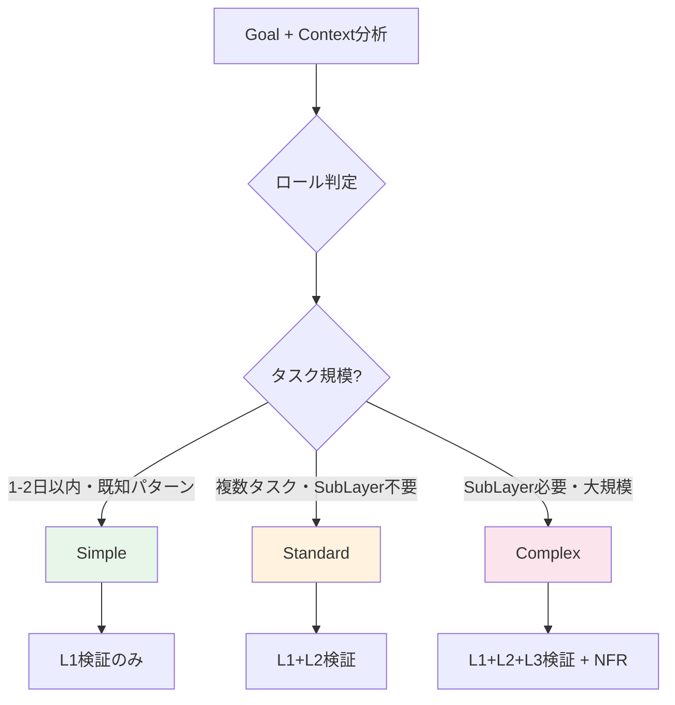

> 🏷️ **Project:** \[YOUR_PROJECT\]
> **Type:** rule
> **Context:** AI-PLC Adaptive Workflow + Next Action判定ルール。Claude Code の `.claude/rules/workflow.md` に相当。ワークフロー深度判定・次アクション自動提案・モード判定を統合。
---
## 概要
> 🎯 **Claude Code対応:** `.claude/rules/workflow.md`
>
> **役割:** Adaptive Workflow深度判定 + Next Action自動提案
>
> **ロード方式:** 自動（RUL_plc_systemから参照）
---
## 1. Adaptive Workflow深度判定（全PJ共通）
SKL_plc_01_collection（Stage 1）で自動判定される3段階の深度。**コーディングPJだけでなく、企画・コンテンツ・イベント等全タスクに適用。**検証ステップ（RUL_plc_system §18）と連動する。
| **深度** | **汎用判定条件** | **パイプライン挙動** | **検証 Level** |
| --- | --- | --- | --- |
| **Simple** | 単一タスク・明確なゴール・既知パターン・1-2日以内 | Stage 1→4直行（Stage 2-3スキップ） | L1のみ |
| **Standard** | 複数タスク・タスク分解が必要・SubLayerなし | 全4ステージを順次実行 | L1+L2 |
| **Complex** | 再帰的分解が必要・SubLayer生成・チーム連携 | 全4ステージ + SubLayer再帰 + NFRフル検証 | L1+L2+L3 |
**正規化ルール:** workflow_depthは必ず `simple` / `standard` / `complex` の3値のいずれか。非スキーマ値は使用禁止。
**Adaptive Skipログ必須:** Simple深度でStage 2-3をスキップする場合、backlog.yamlのrefactoring_logにスキップ理由を記録すること。
### ロール別深度判定基準
| **ロール** | **Simple** | **Standard** | **Complex** |
| --- | --- | --- | --- |
| **product_manager** | フィードバック収集・定例レポート | 機能企画・UX改善 | 新規事業・大規模ピボット |
| **system_architect** | 既存DBにプロパティ追加 | 新規DB設計・ローカル基盤構築 | システム全体アーキテクチャ |
| **tech_lead** | 単純バグ修正・1ファイル変更 | 機能追加・中規模変更 | 新サービス・アーキテクチャ変更 |
| **developer** | バグ修正・ドキュメント修正 | 機能実装・複数ファイル変更 | 大規模リファクタリング |
| **content_strategist** | SNS投稿・定型メール | ブログ記事・プレゼン | 書籍・ホワイトペーパー・シリーズ物 |
| **generic** | 単純な作業・即実行可能 | 複数ステップが必要 | 大規模・未知の領域 |
### 判定フロー

---
## 2. モード判定
SKL_plc_01_collection実行時にGoalの性質から自動判定。
| **モード** | **条件** | **パイプライン挙動** |
| --- | --- | --- |
| **Direct Mode** | 一度きりの実行（設計書、分析、調査等） | Stage 1-4で完了。Stage 5なし |
| **Platform Builder Mode** | 繰り返し実行する仕組みを構築 | Stage 1-5全実行。Stage 4でProduction Skill自動生成→Stage 5で量産 |
---
## 3. Next Action自動提案
各スキル完了時に次のアクションを自動判定し提案する。
### 判定ルール
| **現在の状態** | **Next Action** | **提案文** |
| --- | --- | --- |
| Stage 1完了 | Stage 2（Inception）へ | 「SKL_plc_02_inception を実行してBacklogを作成しましょう」 |
| Stage 2完了 | Stage 3（Construction）へ | 「SKL_plc_03_construction を実行してSkillsを作成しましょう」 |
| Stage 3完了 | Stage 4（Operation）へ | 「SKL_plc_04_operation を実行してタスクを実行しましょう」 |
| Stage 4タスク完了（残あり） | Stage 4ループ | 「次の実行可能タスクはTXXXです」 |
| Stage 4全完了（Direct） | パイプライン終了 | 「全タスク完了。パイプラインを終了します」 |
| Stage 4全完了（Platform Builder） | Stage 5へ | 「Production Skillが生成されました。Stage 5で量産を開始しましょう」 |
| Reinit検出 | Stage 1（Update mode） | 「既存Layerを検出。Update modeで再初期化します」 |
### Next Step Options提示
各ステージ完了後、以下の形式でNext Step Optionsを提示：
> 🔜 **Next Step Options:**
> 1. **\[推奨\]** \[次のステージ/タスク\]
> 2. \[代替アクション\]
> 3. セッション終了（進捗保存済み）
---
## 4. Focus Strategy（視点選択）
Stage 1でGoalの性質から自動判定し、最適なRoleを選択。Roles/配下のテンプレートから読み込む。
| **Goal性質** | **推奨Role** | **判定キーワード** |
| --- | --- | --- |
| プロダクト開発 | ROL_plc_product_manager | 機能、UX、ユーザー、プロダクト |
| システム構築 | ROL_plc_system_architect | DB、API、アーキテクチャ、設計 |
| コンテンツ制作 | ROL_plc_content_strategist | 記事、ブログ、ライティング |
| その他 | ROL_plc_generic | （上記に該当しない） |
---
## 5. Adaptive Direction — Mid-Pipeline Backtrack
> 🔄 **AI-PLCのAdaptive第3軸: パイプライン進行方向の動的変更**
AI-DLCの「Adaptive Breadth（幅の適応）+ Adaptive Depth（深度の適応）」に加え、AI-PLCは**Adaptive Direction（方向の適応）**を導入する。パイプライン進行中にコンテキストに基づいてバックトラック（前ステージへの戻り）をAIが検知・提案する仕組み。
```javascript
AI-PLCの3つのAdaptive軸:
- Adaptive Breadth: ステージのスキップ/選択 (Simple → Stage 1→4直行)
- Adaptive Depth:   各ステージ内の実行深度 (L1/L2/L3)
- Adaptive Direction: パイプライン進行方向の動的変更 (Backtrack)
```
### 5.1 Backtrack Trigger条件マトリクス
| ID | トリガー名 | 検知タイミング | 検知条件 | 提案アクション | 戻り先 |
| --- | --- | --- | --- | --- | --- |
| BT-1 | **Blocker Detection** | Phase 5.5b | L1/L2でcritical NG → 後続タスクの前提が崩壊 | Re-Inception（修正タスク分解） | Stage 2 |
| BT-2 | **Quality Coverage Gap** | Phase 5.5b | L3で受け手視点の検証が不足（E2E未実施、UX未検証等） | Re-Inception（検証タスク追加） | Stage 2 |
| BT-3 | **Milestone Checkpoint** | Phase 6b | root tasks/SubLayer完了率が50%または100%到達 | Re-Inception（残タスク再評価） | Stage 2 |
| BT-4 | **Goal Drift Detection** | Phase 6b | 完了タスク数 \> 5、またはad-hocタスクが2つ以上追加済み | Re-Collection（ゴール再確認） | Stage 1 |
| BT-5 | **External Dependency** | Phase 5.5b | 環境変数未設定/外部サービス未準備を検知 | Ad-hocタスク追加 | (Backlog直接) |
| BT-6 | **Architecture Invalidation** | Phase 5.5b | L2で設計前提との矛盾/スケーラビリティ問題 | Re-Inception（設計変更分解） | Stage 2 |
| BT-7 | **Goal-Gap Analysis** | Phase 6b | backlog内の全タスクがcompleted | Re-Collection（GAP分析） | Stage 1 |
| BT-8 | **Conditional Go Gap** | Phase 6b | Phase 5.5でConditional Go（important残あり）判定 | Re-Inception（検証タスク追加） | Stage 2 |
| BT-9 | **State Correction** | Conversational | ユーザーが進捗訂正・誤報を申告 | 軽量Re-Inception（計画前提再確認） | Stage 2 |
| BT-10 | **Ad-hoc Discovery** | Conversational | 会話中に新事実/検証不足が発見された | Re-Collection or Re-Inception | Stage 1 or 2 |
### 5.2 実行ルール
1. **Backtrackは必ずユーザー承認後に実行**（自動実行禁止）
2. **Next Action Protocolの選択肢として提案**（D/E選択肢を条件付き追加）
3. **該当条件がない場合は選択肢を出力しない**（ノイズ防止）
4. **Backtrack先のStageは scope_reinit モードで実行**（既存成果物を保持）
5. **Backtrack理由はbacklog.yamlのrefactoring_logに記録**
### 5.3 検知タイミングの2レベル
| レベル | Phase | 検知対象 | BT |
| --- | --- | --- | --- |
| タスク単位 | Phase 5.5b | 個別タスクの検証結果 | BT-1, BT-2, BT-5, BT-6 |
| パイプライン全体 | Phase 6b | 全体進捗・ゴール到達度 | BT-3, BT-4, BT-7, BT-8 |
| 会話監視 | セッション全体 | アドホック会話中の新事実・訂正 | BT-9, BT-10 |
### 5.4 Next Action Protocolへの統合
BT該当時、通常の選択肢A/B/Cに加えて以下を出力:
```javascript
🔄 **Adaptive Backtrack 検知:**
| 選択肢 | アクション | 理由 |
| D | Re-Inception | [BT-X: 検知理由] |
| E | Re-Collection | [BT-X: 検知理由] |

推奨: [A or D/E] — [推奨理由]
```
### 5.5 Conversational Backtrack Monitor
Phase境界以外の**通常の会話中**でも、以下の条件を常時監視する軽量レイヤー。
**BT-9 State Correction:** ユーザーが進捗訂正・誤報を申告した場合、Backlog巻き戻しに加え軽量Re-Inceptionを提案。
**BT-10 Ad-hoc Discovery:** 会話中に「〜すべきでは？」「〜が足りない」等の新事実が表面化した場合、パイプラインへの正式取り込みを提案。
**実行ルール:**
1. Conversational BTは**提案のみ**（自動実行禁止）
2. 軽量な1行ヒント形式で出力
3. ユーザーが「このまま続行」を選んだ場合は同一トピックでは再提案しない
4. パイプラインが非アクティブの場合は発火しない
---
## 6. Stage 3 必須ルール（Standard以上）
> 🚨 **workflow_depth が Standard または Complex の場合、Stage 3（Construction）は必ず経由すること。スキップ禁止。**
>
> Inception完了後のNext Action Protocolで「Stage 4に直接進む」選択肢を提示してはならない。
>
> Simple深度のみ Stage 1→4 直行を許可。
### ルール詳細
| workflow_depth | Stage 3 | 理由 |
| --- | --- | --- |
| **Simple** | スキップ可（1→4直行） | 単純タスクはBacklogの情報で十分 |
| **Standard** | **必須** | Agent定義がタスク実行の品質を保証。Lite定義でも必須 |
| **Complex** | **必須（Full定義）** | 複雑タスクはExecution Flow・Guardrailsの事前設計が不可欠 |
### AIへの指示
- Stage 2完了時のNext Action Protocolで、**Standard以上ではStage 3を唯一の推奨選択肢にする**
- 「Backlogの情報で十分だからStage 4に直接進む」という判断は**Standard以上では禁止**
- Stage 3のAgent定義ティア（Lite/Full）は自動判定されるため、オーバーヘッドは最小
---
## ⚙️ AIへの実行指示
> 🤖 **このルールはSKL_plc_01_collection実行時に特に重要**
> ### Stage 1での判定
> 1. Goal分析 → Adaptive Workflow深度を判定（Simple/Standard/Complex）
> 2. Goal性質 → モードを判定（Direct/Platform Builder）
> 3. Goal性質 → Focus Strategyを判定（Roles/から適切なRoleを選択）
> 4. 判定結果をIntent（旧layer.yaml）に記録
> ### 各ステージ完了時
> 1. Next Action判定テーブルに従い次のアクションを特定
> 2. Next Step Options形式で提示
> 3. ユーザーが選択するまで待機（Mob Checkpoint）
> ### Adaptive Backtrack判定（§5）
> 1. Phase 5.5b完了時 → BT-1/BT-2/BT-5/BT-6をチェック
> 2. Phase 6b完了時 → BT-3/BT-4/BT-7をチェック
> 3. 該当あり → Next Action ProtocolにD/E選択肢を追加
> 4. 該当なし → Backtrack選択肢は出力しない（ノイズ防止）
> 5. **Backtrackは必ずユーザー承認後に実行**（自動実行禁止）
---
---
**作成日:** 2026-04-07
**ステータス:** Active
**バージョン:** 1.2（§5.1 BT-8/9/10 + §5.5 Conversational BT + workflow_depth正規化）（§5 Adaptive Direction — Mid-Pipeline Backtrack追加）
