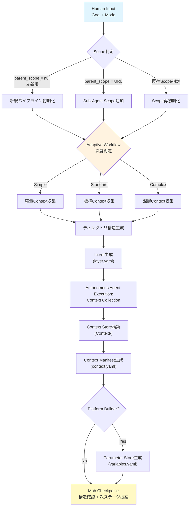

> 🏷️ **Project:** \[YOUR_PROJECT\]
> **Type:** command
> **Context:** AI-PLC Stage 1 — Collection。パイプライン全体の初期化ステージ。Execution Contextを確立し、外部・内部情報源からコンテキストを収集・構造化する。
> 🔗 **必須コンテキスト（このコマンド実行時に自動読み込み）**
> 1. [AI-PLC system](../README.md) — AI-PLCシステム全体
> 2. [RUL_plc_system](../../../rules/ai-plc-system.md) — ルートシステムルール
> 3. [RUL_plc_session](../../../rules/ai-plc-session.md) — セッション管理ルール
> 4. [RUL_plc_adaptive](../../../rules/ai-plc-adaptive.md) — Adaptive Workflow + Next Action判定
> 5. [Templates](../templates) — Templatesフォルダ（Roles + Agent生成テンプレート）
---
## 概要
> 🏗️ **モダン名称:** Collection Stage
>
> **パイプライン位置:** Stage 1 of 4
>
> **Jeff Patton対応:** Sense（現状把握・コンテキスト収集）
パイプライン全体の**初期化ステージ**。Goal と Mode を受け取り、Execution Context（実行スコープ）を確立する。ワークスペース検索・外部情報源からコンテキストを自動収集し、Context Storeに構造化して格納する。
> **Goal と Mode を伝えるだけで、新規プロジェクトもSub-Agent ScopeもScope再初期化も、同じコマンドで実行できます**
### Adaptive Workflow（全PJ共通 — RUL_plc_adaptive §1連動）
> ⚡ **ワークフロー深度の自動判定（コーディングだけでなく全タスク対応）**
>
> Goalの複雑度 + ロール別判定基準に応じて、処理フローの深度を自動調整します：
>
> - **Simple**（1-2日以内・既知パターン）→ Stage 1→4直行。検証L1のみ
>
> - **Standard**（複数タスク・SubLayer不要）→ 全4ステージ順次実行。検証L1+L2
>
> - **Complex**（SubLayer必要・大規模）→ 全4ステージ + SubLayer再帰 + NFRフル検証（L1+L2+L3）
---
## 入力インターフェース
| **入力名** | **型** | **必須** | **説明** | **旧AIPO対応** |
| --- | --- | --- | --- | --- |
| goal | string | ✅ | 達成すべき目標の自然言語記述 | Goal |
| mode | enum\[direct, platform_builder\] | ⭕ | Direct Execution Mode / Platform Builder Mode。デフォルト: direct | concrete / abstract |
| owner | string | ⭕ | 責任者。デフォルト: 現在のユーザー | Owner |
| deadline | date | ⭕ | 期限。デフォルト: +30d | 期間 |
| parent_scope | URL \\| null | ⭕ | 親Execution ContextのURL。Sub-Agent Scope作成時に指定 | Parent Layer |
| scope_name | string | ⭕ | Execution Contextの名称。デフォルト: Goalから自動生成 | Layer名 |
---
## 処理フロー

### Phase 0: Scope判定
```python
if parent_scope is None and existing_scope is None:
    scope_type = "pipeline_init"    # 新規パイプライン
elif parent_scope is not None:
    scope_type = "sub_agent_scope"  # Sub-Agent Scope作成
elif existing_scope is not None:
    scope_type = "scope_reinit"     # Scope再初期化
```
### Phase 1: Adaptive Workflow深度判定（AI-DLC由来）
Goalの複雑度を自動分析し、パイプライン全体のワークフロー深度を決定する：
| **深度** | **判定基準** | **Context収集** | **後続ステージ** |
| --- | --- | --- | --- |
| **Simple** | 単一ドメイン・1-2タスク・既知パターン | 軽量（ワークスペース検索のみ） | Stage 2簡略化 → Stage 4直行 |
| **Standard** | 複数タスク・既存Context活用可能 | 標準（WS検索 + 関連資料収集） | Stage 1→2→3→4 順次実行 |
| **Complex** | 多領域・大規模・未知要素多い | 深層（WS + Web + 外部情報源） | 全5ステージ + Sub-Agent Scope分解 |
### Phase 2: ディレクトリ構造生成
**pipeline_init時:** Temporal Workspace（Flow）配下に標準フォルダ構造を作成
```javascript
📁 Flow/
└── [YYYYMM]/
    └── [YYYY-MM-DD]/
        └── [Scope名]/
            ├── 📄 intent.yaml       （= Intent）
            ├── 📄 context.yaml      （= Context Manifest）
            ├── 📄 backlog.yaml      （= Backlog）
            ├── 📁 Context/          （= Context Store）
            ├── 📁 Agents/           （= Agent定義群）
            ├── 📁 sublayers/        （= Sub-Agent Registry）
            └── 📁 Documents/        （= Artifact Store）
```
**sub_agent_scope時:** 親Scope配下のsublayers/に同構造を作成
**scope_reinit時:** 既存構造を維持し、Intent + Context Manifestを更新
### Phase 3: Intent生成
> 💡 Intent（旧layer.yaml）のテンプレート：
> ```yaml
> # Execution Context メタデータ
> scope_id: "L-MMDD"          # 自動採番
> scope_name: "[Scope名]"
> status: active
> workflow_depth: standard    # simple / standard / complex
>
> # Goal定義
> goal:
> description: "[Goal]"
> success_criteria: []      # Context収集後に設定
>
> # 実行モード
> mode: direct               # direct / platform_builder
>
> # 責任者と期限
> owner: "[Owner]"
> deadline: "[YYYY-MM-DD]"
>
> # 階層関係
> parent_scope: null          # 親ScopeのURL（Sub-Agent時）
> sub_agent_scopes: []        # Stage 2で生成
>
> # External Sync（任意）
> # 外部システムとの同期対象を定義。Post-Deliver Propagation時に自動参照。
> sync_targets: []            # 空=同期なし
> # sync_targets:
> #   - type: notion_db          # notion_db | linear | github_issues
> #     target_url: "db-url" # 同期先のURL/ID
> #     mapping:                 # backlog.yamlフィールド → 外部プロパティ
> #       title: "Name"          # タスク名 → DBプロパティ名
> #       status: "Status"       # ステータス → DBプロパティ名
> #       output: "Output"       # 成果物リンク → DBプロパティ名
> #     status_map:              # AI-PLCステータス → 外部ステータス値
> #       pending: "Not started"
> #       in_progress: "In progress"
> #       completed: "Done"
> #       blocked: "Blocked"
> #     auto_create: false       # true=backlogの新タスクを外部にも自動作成
> #     sync_direction: push     # push | pull | bidirectional
> ```
### Phase 4: Autonomous Agent Execution — Context Collection
**自動Context収集の流れ：**
1. **ワークスペース検索** — Goal関連の情報を自動収集
	- 関連プロジェクト、チーム構成、既存資料
	- 技術スタック、制約条件、ポリシー
2. **\[Standard/Complex\] 外部情報源** — Web検索、技術トレンド、業界標準
3. **\[Sub-Agent Scope\] 親Context継承** — 親ScopeのContext Storeを参照し、Hierarchical Context Cascadeルールに基づき継承
4. **Context Store構築** — 収集情報をカテゴリ別ドキュメントとして格納
```javascript
📁 Context/
├── 📄 01_チーム構成.md
├── 📄 02_関連リンク集.md
├── 📄 03_技術スタック.md
├── 📄 04_制約条件・ポリシー.md
└── 📄 05_既存資料まとめ.md
（Goalに応じてカテゴリを追加・調整）
```
> 📚 **Context情報の二層構造**
>
> Context情報は以下の2つで構成されます：
>
> 1. **Context Store（実体）** — 収集した情報を整理したドキュメント群
>
> 2. **Context Manifest（Index）** — Context Storeへのリンク + 要約情報
>
> **なぜこの構造が重要か：**
>
> - Sub-Agent Scopeに継承したときに、詳細情報が失われない
>
> - 親Scopeeで収集した情報を子Scopeでも参照できる
>
> - Context Manifestはシンプルに保ちつつ、詳細はドキュメントで管理
> 🔑 **Hierarchical Context Cascade**
>
> Sub-Agent Scope作成時、親Contextを3分類ルールで継承：
>
> - **Immutable（Read-only）:** vision, tech_stack等 → 子で変更不可
>
> - **Overridable（Configurable）:** deadline, scope等 → 子で上書き可能
>
> - **Local（Scope-bound）:** team, 固有情報等 → 当該Scopeのみ
>
> **SubLayer継承の具体例：**
>
> ```javascript
> 親Scope: L-0409/Context/ （全社方針、技術スタック等）
> ↓ 継承
> SubScope: L-0409-SG1/Context/ （部門固有の情報）
> + 親のContext/も参照可能
> ```
> これにより、階層が深くなってもコンテキスト情報が薄まらない。
### Phase 3.5: Project Registry SQLite 自動登録
> 📊 **新規Scope作成時、利用環境のAI-PLC DBがある場合は `projects` テーブルに自動登録する。**
>
> Intent生成（Phase 3）完了後、Scope ID / Goal / Mode / Owner / Deadline / トップページURL / 深度 / システム / 親Scope を
>
> AI-PLC DBの `projects` テーブルにレコードとして登録する。
>
> 環境別の既定配置:
> - Claude Code install: `.claude/skills/ai-plc/`
> - Cursor install: `.cursor/skills/ai-plc/`
> - Codex install: `.agents/skills/ai-plc/`
**実行フロー:**
1. AI-PLC DBが利用可能な場合は `projects` テーブルに新規レコードを作成
2. 以下のプロパティを設定:
	- PJ名: scope_name
	- Scope ID: scope_id
	- ステータス: active
	- トップページ: ScopeトップページのURL
	- システム: AI-PLC
	- モード: mode
	- 深度: workflow_depth
	- Owner: owner
	- 親Scope: parent_scope
	- Goal: goal.description
	- 開始日: 今日の日付
	- 期限: deadline
3. 登録完了を通知: 「📊 Project Registry SQLite（projects table）に登録しました」
**スキップ条件:** scope_reinit時（既に登録済みの場合）
### Phase 4.5: Wiki波及更新（Karpathy Ingest原則）
> 🌊 **「1ソースが10-15 wikiページにタッチ」原則**（Karpathy Second Brain）
>
> Context収集で新しい知見を得たら、`.notion/wiki/`配下の関連トピックページに波及更新する。
>
> 詳細: [RUL_plc_system](../../../rules/ai-plc-system.md) §11
**実行フロー:**
1. [index.md](https://www.notion.so/f3e4522534ae439e8fdf798c47de0358) を読み込み、収集したコンテキストに関連するトピックを特定
2. 各関連トピックページに新知見を追記（`- [YYYY-MM-DD] [Source: 収集元] [内容]`）
3. 新規トピックが必要なら作成し、[index.md](http://index.md)に追加
4. 関連トピック間の相互リンク（バックリンク）を追加
5. [log.md](https://www.notion.so/39918cbba9624a9c9488458786956bf0) に`ingest`エントリを追加
**スキップ条件:** 収集した情報が既存wiki知見の範囲内で新規性がない場合
---
### Phase 5: Context Manifest生成
Context Storeのインデックス + 親Context参照 + 継承ルールを記録：
> 💡 Context Manifest（旧context.yaml）のテンプレート：
> ```yaml
> version: "1.0"
> scope_id: "L-MMDD"
> generated_at: "YYYY-MM-DD"
>
> # 親Context参照（Sub-Agent Scope用）
> parent_context_store: null   # 親Scope/Context/ のURL
>
> # Context Documents
> context_documents:
> - name: "チーム構成"
> url: "@Context/01_チーム構成.md"
> summary: "[Owner] lead, 各部門構成とメンバー"
>
> - name: "関連リンク集"
> url: "@Context/02_関連リンク集.md"
> summary: "メンバーDB、組織図、既存プロジェクト等"
>
> - name: "技術スタック"
> url: "@Context/03_技術スタック.md"
> summary: "Notion, Palma, TypeScript, React"
>
> - name: "制約条件・ポリシー"
> url: "@Context/04_制約条件・ポリシー.md"
> summary: "既存Notion活用、新規ツール最小限"
>
> - name: "既存資料まとめ"
> url: "@Context/05_既存資料まとめ.md"
> summary: "過去プロジェクト、参考ドキュメント"
>
> # 継承ルール
> inheritance_rules:
> global_immutable: ["vision", "tech_stack"]
> overridable: ["deadline", "budget"]
> local_only: ["team", "tools"]
> ```
### Phase 6: \[Platform Builder Mode時\] Parameter Store生成
変数化可能なポイントを特定し、Parameter Store（旧variables.yaml）を生成。
> 💡 Parameter Storeのテンプレート：
> ```yaml
> # variables.yaml (Platform Builder Mode用)
> version: "1.0"
> scope_id: "L-MMDD"
>
> # 変数定義
> variables:
> target_person:
> type: "string"
> description: "対象人物名"
> required: true
>
> theme:
> type: "string"
> description: "テーマ"
> required: true
>
> deadline:
> type: "date"
> description: "締切日"
> default: "+7days"
>
> # 変数使用箇所のマッピング
> variable_mappings:
> - task_id: "T001"
> variables: ["target_person"]
> - task_id: "T002"
> variables: ["theme", "target_person"]
> ```
### Phase 6.5: External Sync設定推薦（スキップ禁止）
> 🚨 **Intent生成後に必ず実行。sync_targets検出・ログ出力まで省略してはならない。**
1. **ワークスペース内のタスク管理DBを検索** — 「タスク」「バックログ」「Backlog」「Todo」「Project」等のキーワードで検索
2. **関連するDBが見つかった場合** → 「📊 このDBをsync_targetに設定しますか？」と提案
3. **見つからない場合** → 利用環境のAI-PLC DBがあれば `tasks` テーブルを自動設定
4. **ユーザーが「同期不要」と答えた場合のみ** → `sync_targets: []`
5. **検出結果をログ出力**（`📊 Phase 6.5: External Sync設定 — 検索結果: ... / 設定: ...`）
### Phase 7: Mob Checkpoint — 完了確認と次ステージ提案
1. 作成した構造を確認表示
2. Adaptive Workflow深度の判定結果を報告
3. 次のコマンド提案：
	- **Simple:** 「Stage 2を簡略化し、直接タスク定義に進みます」
	- **Standard:** 「Stage 2: SKL_plc_02_inception で Goal分解に進みます」
	- **Complex:** 「Stage 2で再帰的分解を行います。Sub-Agent Scope候補を提案します」
	※ AI-PLCは4ステージパイプライン（Collection → Inception → Construction → Operation）
---
## 出力インターフェース
| **出力名** | **旧AIPO名** | **説明** | **生成条件** |
| --- | --- | --- | --- |
| Intent | layer.yaml | Execution Contextのメタデータ（ID, Goal, Mode, Owner, Deadline, 親子関係, workflow_depth） | 常に |
| Context Manifest | context.yaml | Context Storeのインデックス + 親Context参照 + 継承ルール | 常に |
| Context Store | Context/ フォルダ | 収集・構造化されたコンテキストドキュメント群 | 常に |
| Backlog | tasks.yaml | タスク登録用ページ（空 or 初期タスク） | 常に |
| Parameter Store | variables.yaml | 変数定義とマッピング | Platform Builder時のみ |
---
## ガードレール・ゲート
| **ゲート名** | **タイミング** | **条件** | **旧CMD対応** |
| --- | --- | --- | --- |
| **Entry Gate** | Phase 0前 | Goal + Mode が提供されていること | Step 0: Human Input |
| **Adaptive Depth Gate** | Phase 1後 | workflow_depth判定結果を暗黙承認（人間が変更可能） | （新規追加） |
| **Exit Gate** | Phase 7 | Intent + Context Manifest + Context Store が生成されていること | Step 4: 完了報告 |
---
## Re-Collection（Adaptive Backtrack対応）
> 🔄 **Operation Stage（Phase 6b）からBacktrack Trigger条件に基づいて呼び出される再実行モード。**
>
> 既存のExecution Contextを保持したまま、ゴール再確認・Context再収集を実施する。
### Re-Collectionのトリガー条件
| BT ID | トリガー名 | 検知フェーズ | Re-Collectionで行うこと |
| --- | --- | --- | --- |
| BT-4 | **Goal Drift Detection** | Phase 6b | ゴールと実績のドリフト分析 → Intent.goal再定義 |
| BT-7 | **Goal-Gap Analysis** | Phase 6b | 全タスク完了後のGAP分析 → 追加ゴール or 完了宣言 |
### Re-Collection実行フロー
1. **既存Intentの読み込み** — 現在の`intent.yaml`を確認（scope_type = `scope_reinit`）
2. **ゴール達成度の評価** — Backlog完了タスクの成果物 vs 元ゴールの到達度を分析
3. **GAP分析レポート出力** — 達成済み / 未達成 / 新規発見の3カテゴリで整理
4. **ゴール更新判定** — GAP分析に基づき:
	- GAPなし → 「ゴール達成。パイプライン完了を推奨」
	- GAPあり → Intent.goalを更新し、Re-Inceptionを推奨
	- ドリフト検知 → ゴール再定義 → Context再収集 → Re-Inception推奨
5. **Context Store追加収集** — ゴール変更がある場合、新ゴールに基づく追加Context収集
6. **Context Manifest更新** — 新規Context参照を追加
### Re-Collection出力形式
```javascript
🔄 Re-Collection（BT-X トリガー）
📍 Scope: [Scope ID]

## GAP分析
| カテゴリ | 内容 |
|---|---|
| 達成済み | [完了タスクの成果] |
| 未達成 | [元ゴールとのGAP] |
| 新規発見 | [パイプライン中に発見された新要件] |

## 判定
- [ゴール達成 / ゴール更新 / ゴール再定義]
- 推奨アクション: [パイプライン完了 / Re-Inception / 追加Context収集]
```
### scope_reinitとの関係
Re-Collectionは既存の`scope_reinit`パスを使用する。Phase 0のScope判定で`existing_scope`が指定されるため、ディレクトリ構造は保持される。差分は:
- **通常のscope_reinit:** ユーザーが手動で新Goalを指定
- **Re-Collection:** Backtrack Triggerに基づきAIがGAP分析を起点にゴール再評価を主導
---
## → 次ステージ接続
Intent + Context Manifest + Context Store を **Stage 2: SKL_plc_02_inception** に渡す
---
## 💬 使用例
### 例1: 新規パイプライン初期化
> 💡 SKL_plc_01_collection を実行してください
>
> Scope名: 社内ナレッジ基盤構築
>
> Goal: 社内ナレッジを構造化・検索可能にする
→ 新規パイプライン構造 + Context Store が一気に完成
### 例2: Sub-Agent Scope追加
> 💡 SKL_plc_01_collection を実行してください
>
> Parent Scope: L-0406
>
> Scope名: Product部門基盤
>
> Goal: プロダクト開発の業務基盤を整備
→ L-0406配下にSub-Agent Scopeとして追加。親Contextを自動継承
### 例3: Platform Builder Mode
> 💡 SKL_plc_01_collection を実行してください
>
> Scope名: ブログ記事量産システム
>
> Goal: ブログ記事を量産できる仕組みを作る
>
> Mode: platform_builder
→ Parameter Storeも生成され、量産用パイプラインとして構築
### 例4: Re-Collection（Backtrackトリガー）
> 💡 SKL_plc_01_collection を実行してください
>
> Scope: L-0409-ABT（既存）
>
> モード: Re-Collection（BT-7: Goal-Gap Analysis）
→ 既存Intentを保持しつつGAP分析を実施。ゴール達成度を評価し次アクションを提案
---
## ⚙️ AIへの実行指示
> 🤖 **重要: 事前参照**
>
> 実行前に必ず以下を参照：
> - [RUL_plc_system](../../../rules/ai-plc-system.md)（ルートシステムルール）
> - [RUL_plc_session](../../../rules/ai-plc-session.md)（セッション管理ルール）
> ---
> **AIへの指示（このコマンドが@メンションされたとき）**
> ### Phase 0: Scope判定
> ```python
> if parent_scope is None and existing_scope is None:
> scope_type = "pipeline_init"    # 新規パイプライン
> elif parent_scope is not None:
> scope_type = "sub_agent_scope"  # Sub-Agent Scope作成
> elif existing_scope is not None:
> scope_type = "scope_reinit"     # Scope再初期化
> ```
> ### Phase 1: Adaptive Workflow深度判定
> Goalの複雑度を分析し、workflow_depthを判定：
> ```python
> # 判定ロジック
> if goal_is_single_domain and estimated_tasks <= 2:
> workflow_depth = "simple"
> elif goal_requires_multi_domain or estimated_tasks >= 8:
> workflow_depth = "complex"
> else:
> workflow_depth = "standard"
> ```
> 判定結果をユーザーに報告。ユーザーが変更した場合はそれに従う。
> ### Phase 2: ディレクトリ構造生成
> 1. 現在の日付から`YYYYMM`と`YYYY-MM-DD`を生成
> 2. Temporal Workspace（Flow）配下に標準フォルダ構造を作成
> 3. 基本フォルダを作成: Context/ / Agents/ / sublayers/ / Documents/
> ⚠️ **旧名称を使わないこと:** Commands/→Agents/、layer.yaml→intent.yaml、tasks.yaml→backlog.yaml
> ### Phase 3: Intent生成
> - ページ名は `intent.yaml`（旧layer.yamlではない）
> - **❗ 必ずYAMLコードブロック形式で記述すること。テーブル形式禁止。**
> - Scope ID自動採番（L-MMDD, L-MMDD-SG1, L-MMDD-SG1-1 等）
> - workflow_depthを反映
> - ステータス: active
> ### Phase 3.5: Project Registry SQLite 自動登録
> 1. [AI-PLC Projects DB](https://www.notion.so/8f5680ace0254d3e9d82c260b4a1fc73) DBのデータソースに新規ページを作成
> 2. プロパティ設定: PJ名=scope_name / Scope ID=scope_id / ステータス=active / トップページ=ScopeトップURL / システム=AI-PLC / モード=mode / 深度=workflow_depth / Owner=owner / 親Scope=parent_scope / Goal=goal.description / 開始日=今日 / 期限=deadline
> 3. 登録完了を通知: 「📊 Project Registry SQLite（projects table）に登録しました」
> 4. **スキップ:** scope_reinit時（既に登録済み）
> ### Phase 4: Autonomous Agent Execution — Context Collection
> 1. ワークスペース検索で関連情報を自動収集
> 2. \[Standard/Complex\] Web検索・外部情報源も活用
> 3. \[Sub-Agent Scope\] 親Context Storeを読み込み、Hierarchical Context Cascadeルールで継承
> 4. Context Storeにカテゴリ別ドキュメントとして格納
> ### Phase 4.5: Wiki波及更新
> 1. `.notion/wiki/index.md`を読み込み
> 2. 収集コンテキストに関連するトピックを特定
> 3. 各関連トピックに新知見を追記 + バックリンク追加
> 4. 必要なら新規トピック作成 + [index.md](http://index.md)更新
> 5. `log.md`に`ingest`エントリ追加
> 6. 新規性がない場合はスキップ（RUL_plc_system §11参照）
> ### Phase 5: Context Manifest生成
> - **❗ 必ずYAMLコードブロック形式で記述すること。テーブル形式禁止。**
> - Context Store内の各ドキュメントへの参照
> - 各ドキュメントのサマリー（3-5行）
> - 親Context参照（Sub-Agent Scopeの場合）
> - 継承ルールの定義
> ### Phase 6: \[Platform Builder Mode時\] Parameter Store生成
> - 変数化可能なポイントを特定
> - 変数定義とデフォルト値
> - 変数使用箇所のマッピング
> ### Phase 6.5: External Sync設定推薦（スキップ禁止）
> <callout icon="🚨" color="red_bg">
> **このPhaseは必ず実行すること。sync_targets検出 → ログ出力まで省略してはならない。**
>
	1. ワークスペース内のタスク管理DBを検索（「タスク」「バックログ」「Backlog」「Todo」「Project」等）
	2. 関連するDBが見つかった場合 → 「📊 このDBをsync_targetに設定しますか？」と提案
	3. 見つからなかった場合 → 利用環境のAI-PLC DBがあれば `tasks` テーブルを**自動設定**する
	4. ユーザーが「同期不要」と答えた場合のみ `sync_targets: []` のまま
	5. **検出結果をログ出力する（必須）:**
	**出力形式（必須）:**
	```javascript
📊 Phase 6.5: External Sync設定
- 検索結果: [見つかったDB名 or 「該当なし」]
- 設定: sync_targets → [設定内容]
- intent.yaml更新: [更新済み or スキップ理由]
	```
	**❗ デフォルト動作:** sync_targetsが空のままにしない。必ず探索 → 結果出力 → 自動設定 の3ステップを踏むこと。
	### Phase 7: Mob Checkpoint
	1. 作成した構造を確認表示
	2. workflow_depth判定結果を報告
	3. 次ステージの提案（深度に応じて）
	---
	**🚨 重要ルール**
	- **既存のFlowを使用する**（新規作成しない）
	- **日付フォルダは毎回新しく作成**（既存の日付フォルダには追加しない）
	- **Context収集は必須**（Context Store + Context Manifest）
	- **親Contextは必ず参照**（Sub-Agent Scopeの場合）
	- **Parameter StoreはPlatform Builder Modeのみ**（Direct Execution Modeでは作成しない）
	- **backlog.yamlも初期生成する**（空のBacklogとして。旧tasks.yamlではない）
	- **Adaptive Workflow深度はIntentに記録する**
	---
	**🚨 Mob Checkpoint停止強制ルール（全Phase共通）**
	- **Phase 7（Mob Checkpoint）では必ず停止し、ユーザーの応答を待つ。** ユーザーの返答があるまで次のStageに進まない。
	- Phase 1（Adaptive Workflow深度判定）の結果もユーザーに報告し、変更指示があれば従う。「暗黙承認」として自動続行する場合も、判定結果の出力は省略しない。
	- **ショートカット禁止:** Scope指定やLayer指定があっても、Phase 7のMob Checkpointは省略しない。
	- 停止時は必ず🙋承認待ちブロック（具体的な応答例: OK / 修正 / 差し戻し）を出力する。
	---
	**📝 出力フォーマット規約（必ず遵守）**
	**Phase遷移通知（セクション8）:** 各Phase完了時に📍簡易通知を必ず出力すること。Autonomous Phaseでも「✅ Phase X 完了 → Phase X+1 に進みます」を表示し、ユーザーが途中で割り込めるタイミングを作る。
	[RUL_plc_session](../../../rules/ai-plc-session.md) セクション7-9に従い、**Phase 7: Mob Checkpoint** の出力には必ず以下を4パート含める：
	1. 📍 **現在位置ヘッダー**（コールアウト）— `📍 [Scope ID] > Stage 1: Collection > Phase 7`
	2. ✅ **完了サマリテーブル** — Scope / 完了対象 / 成果物 / ステータス
	3. 📊 **進捗ダッシュボード** — Backlog全体の進捗率
	4. 🔜 **Next Action Protocol** — [RUL_plc_session](../../../rules/ai-plc-session.md) セクション7.4に従い、**選択肢テーブル（A/B/C）+ 推奨理由 + コピペ用プロンプト**の3パートを必ず出力。Stage 1完了後のテンプレートはセクション7.4.4参照。**ユーザーが選択肢を選んでも即実行禁止—コピペ用プロンプトを生成して返すこと。**
	---
	**⚠️ AI-PLC 新命名規則（必ず遵守）**
	以下の旧AIPO名称は絶対に使わないこと：
	| 旧AIPO（❌使用禁止） | AI-PLC（✅正しい名称） |
| --- | --- |
| layer.yaml | **intent.yaml** |
| tasks.yaml | **backlog.yaml** |
| Commands/ | **Agents/** |
| 「aipo管理」 | **「AI-PLC管理」** |
| CMD_ | **SKL_**（スキル参照時） |
| CTX_ | **RUL_**（ルール参照時） |
	管理セクションのトグルヘッダーは `### 🔧 AI-PLC管理（[Scope ID]）` とすること
</callout>
---
## 📁 生成されるフォルダ構造
```javascript
📁 [Scope]/
├── 📄 intent.yaml         ← Intent定義（このコマンドで生成）
├── 📄 context.yaml        ← Context Manifest（このコマンドで生成）
├── 📄 backlog.yaml        ← Backlog初期化（このコマンドで生成）
├── 📁 Context/            ← Context Store（このコマンドで生成）
│   ├── 📄 01_[カテゴリ].md
│   ├── 📄 02_[カテゴリ].md
│   └── ...
├── 📄 variables.yaml      ← Parameter Store（Platform Builder時のみ）
├── 📁 Agents/             ← Agent定義群（Stage 3で生成）
├── 📁 sublayers/          ← Sub-Agent Registry（Stage 2で生成）
└── 📁 Documents/          ← Artifact Store（Stage 4で生成）
```
---
---
**作成日:** 2026-04-06
**ステータス:** Active
**バージョン:** 1.1（Phase 6.5 External Syncスキップ禁止化 + ログ出力必須化）
