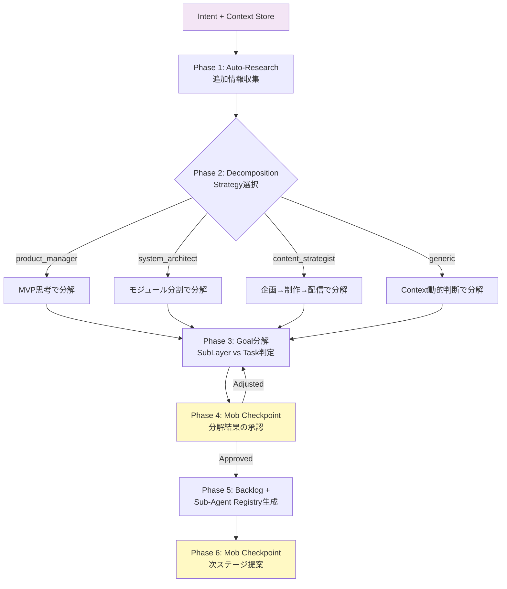
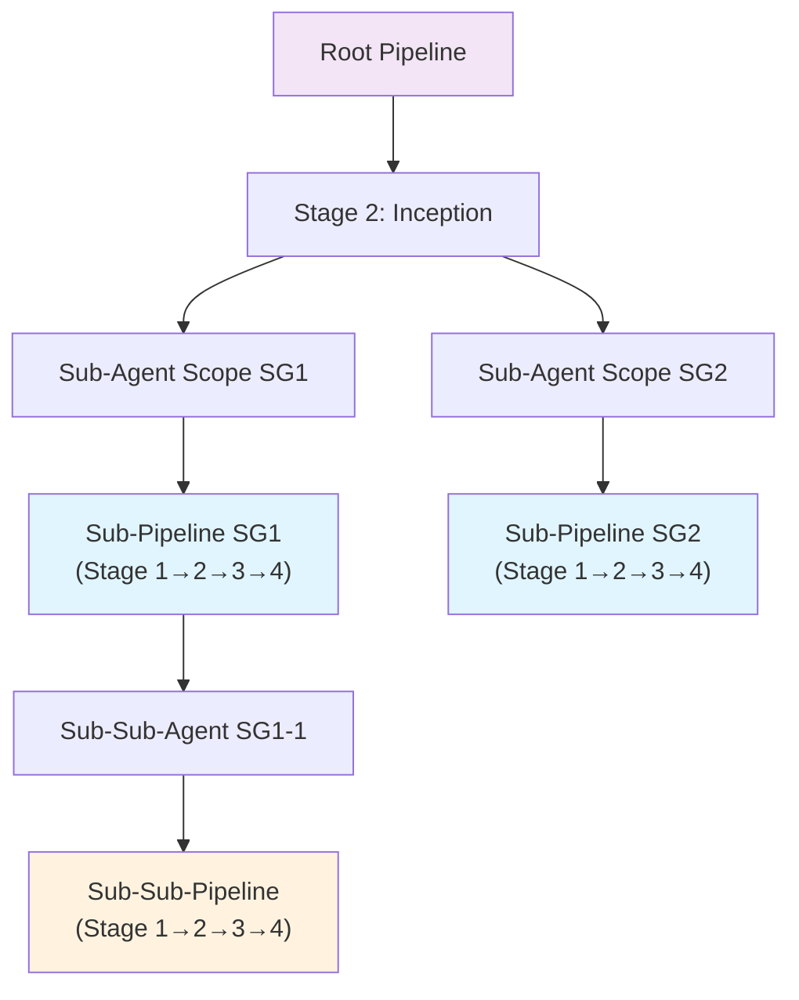

> 🏷️ **Project:** [AI-PLC Project](https://www.notion.so/268b133701be808a81bce066ce075281)
> **Type:** command
> **Context:** AI-PLC Stage 2 — Inception。Goal分析と再帰的分解ステージ。Intent + Context Storeを受け取り、Decomposition Strategyに基づきBacklog（タスク定義）とSub-Agent Registry（SubLayer群）を生成する。
> 🔗 **必須コンテキスト（このスキル実行時に自動読み込み）**
> 1. [AI-PLC system](../README.md) — AI-PLCシステム全体
> 2. [RUL_plc_system](../../../rules/ai-plc-system.md) — ルートシステムルール
> 3. [RUL_plc_session](../../../rules/ai-plc-session.md) — セッション管理ルール
> 4. [RUL_plc_adaptive](../../../rules/ai-plc-adaptive.md) — Adaptive Workflow + Next Action判定
> 5. [Templates](../templates) — Templatesフォルダ（Roles + Agent生成テンプレート）
---
## 概要
> 🔀 **モダン名称:** Inception Stage
>
> **パイプライン位置:** Stage 2 of 4
>
> **Jeff Patton対応:** Focus（優先順位付け・焦点化）
>
> **対応する旧CMD:** [CMD_aipo_02_focus](https://www.notion.so/a0a355ef141d4668946f51a9a1382f9d)
>
> **AI-DLC対応:** Inception Phase（Intent収集 + SubLayer分解）
Goalを分析し、**再帰的エージェント・デリゲーション**（Fractal Decomposition）パターンに基づいてSub-Agent Scope（SubLayer）とTask（実行単位）に分解する。Decomposition Strategy（Adaptive Workflow）の選択により、分解の粒度と方向性を制御する。
> **Intent + Context Storeを渡すだけで、GoalをBacklog + Sub-Agent Registryに自動分解します**
### AI-DLC Inception対応
> ⚡ **AI-DLCのInception Phaseに直接対応**
>
> AI-DLCではMob Elaboration（チーム全員での要件精緻化）がInceptionの中核儀式。AI-PLCでもこのステージでMob的なチーム検証を組み込み可能。
>
> - **Single:** 1対1（人間↔AI）でのGoal分解
>
> - **Mob Inception:** チーム全員でAIの分解提案をレビュー・調整
---
## 入力インターフェース
| **入力名** | **型** | **必須** | **説明** | **旧AIPO対応** |
| --- | --- | --- | --- | --- |
| Intent | Page | ✅ | Stage 1で生成されたExecution Contextメタデータ | layer.yaml |
| Context Manifest | Page | ✅ | Stage 1で生成されたContextインデックス | context.yaml |
| Context Store | Folder | ✅ | Stage 1で収集されたコンテキストドキュメント群 | Context/ |
| decomposition_strategy | enum \\| null | ⭕ | Planning Heuristic（product_manager / system_architect / content_strategist / tech_lead / generic）。デフォルト: AI自動判定 | Focus Strategy |
---
## 処理フロー

### Phase 1: Auto-Research
Intent + Context Storeを読み込み、Goal達成に必要な追加情報をワークスペース/Web検索で収集。
### Phase 2: Decomposition Strategy選択
Goalの性質を自動分析し、最適なPlanning Heuristicを選択（人間指定優先）：
| **戦略** | **適用シーン** | **分解の特徴** |
| --- | --- | --- |
| **Product Manager** | プロダクト開発・改善 | Discovery→Delivery、MVP思考 |
| **System Architect** | システム構築・基盤整備 | 設計→実装→運用、モジュール分割 |
| **Content Strategist** | コンテンツ制作・発信 | 企画→制作→配信、品質管理 |
| **Tech Lead** | コーディングPJ（複数実装タスク） | Adaptive Skip判定 + SubLayer分割 + Per-Layer Loop統括 |
| **Generic** | その他すべて | Contextから動的判断 |
### Phase 3: Goal分解
Goalを2種に分類：
- **Sub-Agent Scope（SubLayer）** — 複雑で独自Contextが必要。再帰的にパイプライン全体を展開
- **Task** — 1-2日で完結する実行可能な作業単位
> 💡 **分解判断基準**
>
> **SubLayer化する場合:** 複数Taskで構成 / 独自Context必要 / 他者に委譲可能 / 独立スケジュール
>
> **Task化する場合:** 1-2日で完了 / これ以上分解不要 / 管理・調整系作業
### Phase 4: Mob Checkpoint — 分解承認
提案された分解結果を人間（またはチーム）が確認・調整。
### Phase 5: Backlog + Sub-Agent Registry生成
- **Backlog（旧tasks.yaml）** にタスク定義・依存関係・ステータスを記録
- **Sub-Agent Registry（sublayers/）** にSubLayerフォルダ構造を作成
- **\[Platform Builder Mode時\]** Database + Production Skills の2軸で標準分解パターン適用
### Phase 5.5: 外部実行タスク判定 + External Sync促し
> 📤 **「今このPJで実行しないタスク」があれば、External Syncを促す。**
Backlog生成後、各タスクを以下の基準で判定:
| **判定** | **基準** | **アクション** |
| --- | --- | --- |
| ✅ PJ内実行 | このLayerのAI/オーナーが実行する | そのままBacklogに残す |
| 📤 外部委譲 | 別の実行者（エンジニア・デザイナー・別チーム）がやるべき | **External Syncを促す** → Self-Describing構造で外部DBに書き出し |
| ⏳ 先送り | 今はやらないが将来やる | Backlogに`deferred`ステータスで残す（Propagation時に再判定） |
**外部委譲時の出力:**
- [RUL_plc_system](../../../rules/ai-plc-system.md) §9のSelf-Describing Task構造に従い、コンテキスト付きチケットを生成
- 「このタスクを外部DBに書き出しますか？」とユーザーに確認
- 承認後、sync_targetsに従って外部にpush
### Phase 6: Mob Checkpoint — 次ステージ提案
1. 生成した構造を確認表示
2. 次のアクションを提案：
	- SubLayerあり → 各SubLayerで SKL_plc_01_collection を案内
	- Tasksのみ → Stage 3: SKL_plc_03_construction を案内
---
## 出力インターフェース
| **出力名** | **旧AIPO名** | **説明** | **生成条件** |
| --- | --- | --- | --- |
| Backlog | tasks.yaml | タスク定義（ID, Name, Type, Status, Dependencies, Skill参照） | 常に |
| Sub-Agent Registry | sublayers/ フォルダ | デリゲーション先スコープのフォルダ構造 | SubLayer生成時 |
| Artifact Store（初期化） | Documents/ フォルダ | 分析過程で生成されたドキュメント群 | 常に |
---
## ガードレール・ゲート
| **ゲート名** | **タイミング** | **条件** | **旧CMD対応** |
| --- | --- | --- | --- |
| **Decomposition Gate** | Phase 4 | 分解結果の人間承認（SubLayer↔Task分類の調整） | Step 3: Human Approves |
| **Session Split Gate** | Phase 4 | SubLayer≥3 or タスク≥10 → セッション分割推奨 | Phase 3.5 |
| **Exit Gate** | Phase 6 | Backlog内の全タスクにtype/priorityが設定済み | Step 4: 構造生成 |
---
## 再帰的デリゲーション（パイプラインのネスト）

Sub-Agent Scopeが生成されると、そのスコープ内で**Stage 1から再びパイプライン全体が展開**される。これが「再帰的エージェント・デリゲーション」であり、同一パターンの無限階層展開を実現する。
---
## 旧CMD対応表
| **SKL_plc_02_inception** | **CMD_aipo_02_focus** | **変更内容** |
| --- | --- | --- |
| Phase 1: Auto-Research | Step 1: AI Auto-Research | 語彙変更のみ |
| Phase 2: Decomposition Strategy選択 | Step 1.5: 専門家ロール選択 | Adaptive Workflow判定と統合 |
| Phase 3: Goal分解 | Step 2: Focus分解 & 判定 | SubLayer/Task分類基準を明文化 |
| Phase 4: Mob Checkpoint（分解承認） | Step 3: Human Approves | HITL→Mob。チーム検証を標準オプション化 |
| Phase 5: Backlog + Sub-Agent Registry生成 | Step 4: 構造生成 | Task Registry→Backlog。commandフィールド必須ルール維持 |
| Phase 6: Mob Checkpoint（次ステージ提案） | Next Step Options | 語彙変更 + SKL名での案内 |
---
---
## Re-Inception（Adaptive Backtrack対応）
> 🔄 **Operation Stage（Phase 5.5bまたはPhase 6b）からBacktrack Trigger条件に基づいて呼び出される再分解モード。**
>
> 既存のBacklogを保持したまま、差分タスクの追加・修正を実施する。
### Re-Inceptionのトリガー条件
| **BT ID** | **トリガー名** | **検知フェーズ** | **Re-Inceptionで行うこと** |
| --- | --- | --- | --- |
| BT-1 | **Blocker Detection** | Phase 5.5b | ブロッカー原因分析 → 修正タスクをBacklogに追加 |
| BT-2 | **Quality Coverage Gap** | Phase 5.5b | 不足検証項目の特定 → 検証タスクをBacklogに追加 |
| BT-3 | **Milestone Checkpoint** | Phase 6b | 残タスクの妥当性再評価 → 不要タスク削除 / 新規タスク追加 |
| BT-5 | **External Dependency** | Phase 5.5b | 外部依存の解決タスクをBacklogに追加 |
| BT-6 | **Architecture Invalidation** | Phase 5.5b | 設計変更を反映したタスク再分解 |
### Re-Inception実行フロー
1. **既存Backlog読み込み** — 現在の`backlog.yaml`を確認（completedタスクは保持）
2. **トリガー分析** — BT条件の検知理由を深掘りし、必要なアクションを特定
3. **差分分解** — 既存タスクを壊さず、以下のいずれかを実施:
	- **タスク追加:** 新規タスクIDを採番してBacklogに追加
	- **タスク修正:** 既存タスクのdescription/priority/dependenciesを更新
	- **タスク削除:** 不要タスクのstatusを`cancelled`に変更（物理削除しない）
4. **refactoring_log記録** — Backlogの`refactoring_log`セクションに変更理由を記録
5. **Mob Checkpoint** — 差分をユーザーに提示し承認を求める
6. **Backlog更新** — 承認後にbacklog.yamlを更新
### Re-Inception出力形式
```javascript
🔄 Re-Inception（BT-X トリガー）
📍 Scope: [Scope ID]

## トリガー分析
- 原因: [BT-X検知理由の詳細]
- 影響範囲: [影響を受けるタスクID一覧]

## Backlog差分
| 操作 | タスクID | 内容 | 理由 |
|---|---|---|---|
| 追加 | T00X | [タスク名] | [追加理由] |
| 修正 | T00Y | [変更内容] | [修正理由] |
| 削除 | T00Z | cancelled | [削除理由] |

## refactoring_log エントリ
- date: [日付]
- trigger: BT-X
- reason: [理由]
- changes: [変更サマリ]
```
### 通常Inceptionとの差分
| **項目** | **通常Inception** | **Re-Inception** |
| --- | --- | --- |
| 起点 | Collection完了後 | Operation中のBT検知 |
| Backlog | ゼロから生成 | 既存を保持し差分追加 |
| SubLayer | 新規作成可能 | 原則追加なし（必要時のみ） |
| Phase 1-3 | フル実行 | トリガー分析→差分分解のみ |
| Phase 4 | 全体承認 | 差分のみ承認 |
| refactoring_log | 初回は空 | 変更理由を必ず記録 |
## → 次ステージ接続
Backlog + Sub-Agent Registry を **Stage 3: SKL_plc_03_construction** に渡す
---
## 💬 使用例
### 例1: 基本実行
> 💡 SKL_plc_02_inception を実行してください
>
> Layer: \[対象LayerのURL\]
### 例2: 戦略指定
> 💡 SKL_plc_02_inception を実行してください
>
> Layer: \[対象LayerのURL\]
>
> Decomposition Strategy: Product Manager視点で分解
### 例3: Mob Inception
> 💡 SKL_plc_02_inception を実行してください
>
> Layer: \[対象LayerのURL\]
>
> Mode: Mob（チーム全員でレビュー）
---
### 例4: Re-Inception（Backtrackトリガー）
> 💡 SKL_plc_02_inception を実行してください
>
> Layer: \[対象LayerのURL\]
>
> モード: Re-Inception（BT-1: Blocker Detection — E2Eテストで発見されたバグの修正タスクを追加）
→ 既存Backlogを保持しつつ、修正タスクを差分追加。refactoring_logに変更理由を記録
---
## ⚙️ AIへの実行指示
> 🤖 **重要: 事前参照**
>
> 実行前に必ず以下を参照：
> - [RUL_plc_system](../../../rules/ai-plc-system.md)（ルートシステムルール）
> - [RUL_plc_session](../../../rules/ai-plc-session.md)（セッション管理ルール）
> - [Templates](../templates)（Templatesフォルダ — Roles + Agent生成テンプレート）
> ---
> **AIへの指示（このスキルが@メンションされたとき）**
> ### Phase 1: Auto-Research
> 1. Intent（旧layer.yaml）、Context Manifest（旧context.yaml）を読み込む
> 2. Context Store内のドキュメントを参照
> 3. 関連情報をワークスペース/Web検索で追加収集
> ### Phase 2: Decomposition Strategy選択
> 1. Goalの性質を分析し、最適な戦略を判定
> 2. ユーザー指定があればそれを優先
> 3. 判定結果をユーザーに報告（暗黙承認可）
> ### Phase 3: Goal分解
> 1. Goalを SubLayer（複雑→再帰展開）と Task（単純→このLayerで完結）に分類
> 2. 詳細タスクは親Layerで作らない（SubLayer内で展開）
> 3. \[Platform Builder Mode\] Database + Production Skills の2軸で標準分解
> 4. 全TaskにcommandフィールドとPriorityを設定
> ### Phase 4: Mob Checkpoint（分解承認）
> 1. SubLayersとTasksの一覧を提案
> 2. セッション分割判定（SubLayer≥3 or タスク≥10）
> 3. ユーザー承認を求める
> ### Phase 5: Backlog + Sub-Agent Registry生成
> 1. Backlog（旧tasks.yaml）を生成
> - **❗ 必ずYAMLコードブロック形式で記述すること。テーブル形式禁止。**
> - 以下のフィールドを全タスクに必須: `id` / `name` / `description` / `type` / `priority` / `status` / `owner` / `estimated_hours` / `command` / `command_template_ref` / `origin`
> - 以下のトップレベルセクションを必須: `focus_strategy` / `focus_strategy_reason` / `focus_strategy_confirmed_by` / `decomposition_pattern` / `sublayers` / `tasks` / `summary`（task_count / p0_tasks / p1_tasks / p2_tasks / next_action）
> - 再分解があった場合は `refactoring_log` セクションも含める
> - 参考例: [tasks.yaml（ハーネスPJ）](https://www.notion.so/c06d7eba601644779458e9672de603a0)
> 2. SubLayerフォルダを作成
> 3. 各SubLayerに「次のステップ」セクションを含める
> ### Phase 6: Mob Checkpoint（次ステージ提案）
> 1. 生成した構造を確認表示
> 2. 次のアクションをオプション形式で提案
> ---
> **🚨 重要ルール**
> - **SubGoalの詳細タスクはこのステージでは作らない**（SubLayer内で展開）
> - **全Taskにcommandフィールドを必須設定**（management系のみnull許可）
> - **mode継承**: 親のmodeを全SubLayerに継承
> - **Backlog生成時の検証**: focus_strategy / focus_strategy_reason / focus_strategy_confirmed_by を必須記録
> ---
> **🚨 Mob Checkpoint停止強制ルール（全Phase共通）**
> - **Phase 4（分解承認）では必ず停止し、ユーザーの応答を待つ。** ユーザーの返答があるまでPhase 5（Backlog生成）に進まない。
> - **Phase 6（次ステージ提案）でも必ず停止し、Next Action Protocolを出力してユーザーの選択を待つ。**
> - **ショートカット禁止:** Layer指定やタスク数が少なくても、Phase 4のMob Checkpointは省略しない。
> - 停止時は必ず🙋承認待ちブロック（具体的な応答例: OK / 修正: \[指示\] / 差し戻し）を出力する。
> ---
> **📝 出力フォーマット規約（必ず遵守）**
> **Phase遷移通知（セクション8）:** 各Phase完了時に📍簡易通知を必ず出力すること。Autonomous Phaseでも「✅ Phase X 完了 → Phase X+1 に進みます」を表示し、ユーザーが途中で割り込めるタイミングを作る。
> [RUL_plc_session](../../../rules/ai-plc-session.md) セクション7-9に従い、**Phase 4 / Phase 6 の Mob Checkpoint** 出力には必ず以下を含める：
> - **Phase 4（分解承認）:** 📍現在位置 + 分解テーブル + 承認後フロー説明（1行: 「承認 → Phase 5でBacklog生成 → Phase 6でNext Action提示」） + 🙋承認待ちコールアウト（具体的な応答例付き: `→ 「OK」（そのまま進行） / 「修正: [具体的な指示]」 / 「差し戻し」（Phase 1からやり直し）`）
> - **Phase 6（完了）:** 📍現在位置 + 完了サマリテーブル + 📊進捗ダッシュボード + 🔜**Next Action Protocol**（[RUL_plc_session](../../../rules/ai-plc-session.md) 7.4: 選択肢テーブル + 推奨理由 + コピペ用プロンプト。Stage 2完了後テンプレートは7.4.4参照。即実行禁止）
> ---
> **⚠️ AI-PLC 新命名規則（必ず遵守）**
> | 旧AIPO（❌使用禁止） | AI-PLC（✅正しい名称） |
| --- | --- |
| layer.yaml | **intent.yaml** |
| tasks.yaml | **backlog.yaml** |
| Commands/ | **Agents/** |
| 「aipo管理」 | **「AI-PLC管理」** |
> 管理セクションのトグルヘッダーは `### 🔧 AI-PLC管理（[Scope ID]）` とすること
---
## 参照元
- [T002_コマンド体系再定義書](https://www.notion.so/6c404df8242549df8199dadb2a187660) — Stage 2定義（本ページのベース）
- [T003_コア原理再定義書](https://www.notion.so/e81ef93779fd4a5c85d83a93791e3dd5) — Fractal Decomposition / Context Cascade原理
- [T007_新コマンド体系アーキテクチャ設計書](https://www.notion.so/d39600b2da7142679bc22451089aeeae) — テンプレート構造・命名規則
- [CMD_aipo_02_focus](https://www.notion.so/a0a355ef141d4668946f51a9a1382f9d) — 旧版コマンド（対応元）
---
**作成日:** 2026-04-07
**ステータス:** Active
**バージョン:** 1.0
