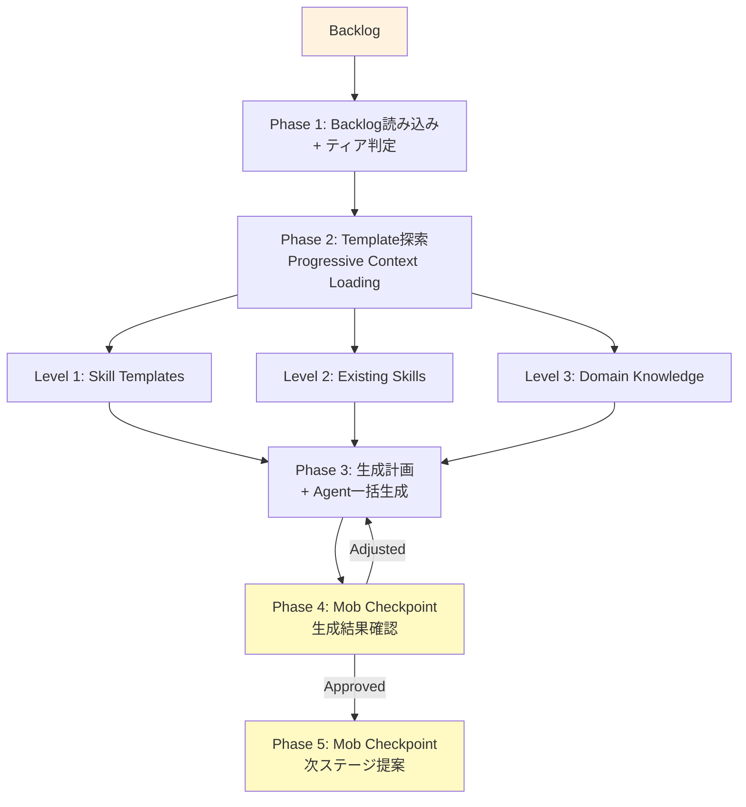

> 🏷️ **Project:** [AI-PLC Project](https://www.notion.so/268b133701be808a81bce066ce075281)
> **Type:** command
> **Context:** AI-PLC Stage 3 — Construction。Backlogの各タスクに対して実行可能なスキル定義（Harness）を生成するステージ。既存テンプレートからのProgressive Context Loadingとタスク固有コンテキストに基づく動的生成を組み合わせる。
> 🔗 **必須コンテキスト（このスキル実行時に自動読み込み）**
> 1. [AI-PLC system](../README.md) — AI-PLCシステム全体
> 2. [RUL_plc_system](../../../rules/ai-plc-system.md) — ルートシステムルール
> 3. [RUL_plc_session](../../../rules/ai-plc-session.md) — セッション管理ルール
> 4. [RUL_plc_adaptive](../../../rules/ai-plc-adaptive.md) — Adaptive Workflow + Next Action判定
> 5. [Templates](../templates) — Templatesフォルダ（Roles + Agent生成テンプレート）
---
## 概要
> ⚙️ **モダン名称:** Construction Stage
>
> **パイプライン位置:** Stage 3 of 4
>
> **Jeff Patton対応:** Discover（実行計画の立案・検証）
>
> **対応する旧CMD:** [CMD_aipo_03_discover](https://www.notion.so/4dce59e7880b4e40956510012702d18e)
>
> **AI-DLC対応:** Construction Phase（Domain Design + Logical Design + コード生成）
Backlogの各タスクに対して、**実行可能なスキル定義**（Harness）を生成するステージ。既存のSkill Template（旧command_templates）からの**Progressive Context Loading**と、タスク固有コンテキストに基づく動的生成を組み合わせる。
> **Backlogを渡すだけで、各タスクの実行用スキルページを自動生成します**
### v1.1 軽量化改修（2026-04-09）
- **Agent定義ティア制:** Lite（4セクション）/ Full（6セクション）をタスクtypeで使い分け
- **Mob CP統合:** Phase 4（設計承認）を廃止し、Phase 5生成後のPhase 6のみで承認
- **一括生成モード:** Task未指定時に全commandありタスクのAgentを一括生成
### AI-DLC Construction対応
> ⚡ **AI-DLCのConstruction Phaseに直接対応**
>
> AI-DLCではMob Construction（チーム全員でのAI生成物検証）がConstructionの中核儀式。AI-PLCでもこのステージでスキル設計のチーム検証を組み込み可能。
>
> - **Domain Design** → タスク固有のハーネス設計（Goal/Input/Output/Flow定義）
>
> - **Code Generation** → 実行可能なスキルページの自動生成
>
> - **Coding PJ** → コーディング用テンプレート（TPL_coding_agent / TPL_review_agent）が適用されたSubLayerが再帰展開される（特別フェーズ不要）
---
## 入力インターフェース
| **入力名** | **型** | **必須** | **説明** | **旧AIPO対応** |
| --- | --- | --- | --- | --- |
| Backlog | Page | ✅ | Stage 2で生成されたタスク定義 | tasks.yaml |
| Agent Template Library | Folder | ⭕ | Agent生成テンプレート（TPL_\*）。`.notion/Templates/Agents_template/`配下 | command_templates/ |
| Existing Agents | Folder | ⭕ | 過去に生成された再利用可能なAgent定義群 | Commands/ |
---
## 処理フロー

### Phase 1: Backlog読み込み + ティア判定
各タスクのcommandフィールドとcommand_template_refを確認し、**Agent定義ティア**を自動判定。
### Agent定義ティア制（Lite / Full）
| **ティア** | **対象タスクtype** | **含むセクション** | **省略するもの** |
| --- | --- | --- | --- |
| **Lite** | design, research, content, planning | Goal + Input + Output + Guardrails | Execution Flow詳細, Agent Instructions（テンプレートから暗黙適用） |
| **Full** | implementation, validation, complex, coding | 全6セクション（Goal/Input/Output/Flow/Guardrails/Instructions） | なし |
**判定ルール:** `agent_tier`はbacklog.yamlの`type`フィールドから自動判定。ユーザーが明示指定した場合はそちらを優先。
### Phase 2: Template探索（Progressive Context Loading）
3段階の探索：
- **Level 1:** Agent Template Library（`.notion/Templates/Agents_template/`配下のTPL_\*）
- **Level 2:** 既存Skills（過去のハーネス定義）
- **Level 3:** ドメイン知識テンプレート（AIPMコマンド群等）
### Phase 3: スキル生成計画 + Agent一括生成
テンプレートマッチングとAgent定義を一括生成。**旧Phase 4（設計承認）は廃止し、生成後のPhase 4で結果確認。**
### コーディングPJでのAgent生成
> 💻 **コーディングPJでも特別フェーズは不要。テンプレートの違いだけ。**
>
> コーディング用テンプレート（[TPL_coding_agent](../templates/agents/TPL_coding_agent.md) / [TPL_review_agent](../templates/agents/TPL_review_agent.md)）が選択されると、生成されるAgentのFlow内にFunctional Design → Code Gen → Build & Testが組み込まれる。
>
> 各SubLayerは通常どおり4ステージを再帰展開し、**SubLayer内のInception = 機能設計、Construction = コード生成計画、Operation = 実装+テスト** となる。
**Adaptive Skip判定（テンプレート内で制御）:**
| **深度** | **判定条件** | **SubLayer内の再帰展開** |
| --- | --- | --- |
| **Simple** | 単純バグ修正・1ファイル変更 | Collection → Construction（直接Code Gen）→ Operation |
| **Standard** | 機能追加・中規模変更 | Collection → Inception（FD設計）→ Construction（Code Gen Plan）→ Operation（実行+テスト） |
| **Complex** | 新サービス・アーキテクチャ変更 | フル4ステージ（NFR + Infrastructure Design含む） |
ロール: [TPL_role_tech_lead](../templates/roles/TPL_role_tech_lead.md)（SubLayer分割・統括） / [TPL_role_developer](../templates/roles/TPL_role_developer.md)（実装）
### Phase 4: Mob Checkpoint — 生成結果確認
一括生成されたAgent定義の確認。修正指示があれば反映。
### 一括生成モード
| **モード** | **トリガー** | **動作** |
| --- | --- | --- |
| **単体** | `Task: T002` 指定 | そのタスクのみAgent生成 |
| **一括** | Task未指定（デフォルト） | 全commandありタスクのAgentを一括生成。Mob CPは1回のみ |
### Agent定義の標準構造
| **セクション** | **内容** | **役割** |
| --- | --- | --- |
| Goal | このAgentが達成すること | 成功基準の定義 |
| Input | 必要な入力データ・コンテキスト | 実行前提条件 |
| Output | 生成される成果物 | 完了判定基準 |
| Execution Flow | Phase構造（Autonomous + Mob Checkpoint） | 実行手順 |
| Guardrails | 各Phaseのガードレール条件 | 品質保証 |
| Agent Instructions | Stage 4実行時のAI指示（= CCでのシステムプロンプト） | 自動実行制御 |
> 🤖 **Agent定義 = 実行手順 + 制約 + ツール権限が1つにまとまったもの。**
>
> Claude Code installでは`.claude/agents/*.md`、Cursor installでは`.cursor/skills/ai-plc/`、Codex installでは`.agents/skills/ai-plc/`を基準に配置・参照する。
>
> NotionではAgent定義ページとしてGoal/Input/Output/Flow/Guardrails/AI実行指示を記載。
>
> 詳細: [AI-PLC README](../README.md)
### Phase 5.5: スコープ外タスク検出 + External Sync
> 📤 **スキル設計中に「このPJではやらないが必要な作業」を発見したら、External Syncを促す。**
Agents生成中に以下のパターンを検出:
- スキルの前提条件として「別チームの作業完了」が必要 → **その作業を外部チケット化**
- スキルのOutputが別システムでの実装を要求 → **実装チケットを外部に委譲**
- スコープ外だが価値がある改善点を発見 → **Product Backlogに蓄積**
検出時のアクション:
1. [RUL_plc_system](../../../rules/ai-plc-system.md) §9のSelf-Describing Task構造でチケットを生成
2. 「スコープ外タスクを発見しました。外部DBに書き出しますか？」と確認
3. 承認後、sync_targetsに従ってpush
### Phase 5: Mob Checkpoint — 次ステージ提案
スキル生成完了を確認し、Stage 4: SKL_plc_04_operation への遷移を提案。
---
## 出力インターフェース
| **出力名** | **旧AIPO名** | **説明** | **生成条件** |
| --- | --- | --- | --- |
| Agents | Commands/ フォルダ | 実行可能なAgent定義群 | 常に |
---
## ガードレール・ゲート
| **ゲート名** | **タイミング** | **条件** | **旧CMD対応** |
| --- | --- | --- | --- |
| **Generation Result Gate** | Phase 4 | 一括生成されたAgent定義の確認・承認 | Step 4: Human Approves |
| **Exit Gate** | Phase 5 | commandフィールドを持つ全タスクにスキル定義が生成されていること | Step 5: 生成完了 |
---
## 旧CMD対応表
| **SKL_plc_03_construction** | **CMD_aipo_03_discover** | **変更内容** |
| --- | --- | --- |
| Phase 1: Backlog読み込み | Step 1: tasks.yaml読み込み | Task Registry→Backlog。語彙変更 |
| Phase 2: Template探索 | Step 2: テンプレート・既存コマンド探索 | Progressive Context Loading 3段階を明文化 |
| Phase 3: スキル生成計画提案 | Step 3: コマンド生成計画の提案 | Skill Library→Skills。語彙変更 |
| Phase 4: Mob Checkpoint | Step 4: Human Approves | HITL→Mob。チーム検証を標準オプション化 |
| Phase 5: Agents生成 | Step 5: コマンド生成 | Commands/→Agents/。HITL統合型構造を維持 |
| Phase 6: Mob Checkpoint | Step 6: Next Step | 語彙変更 + SKL名での案内 |
---
## → 次ステージ接続
Agents を **Stage 4: SKL_plc_04_operation** に渡す
---
## 💬 使用例
### 例1: 基本実行
> 💡 SKL_plc_03_construction を実行してください
>
> Layer: \[対象LayerのURL\]
### 例2: テンプレート指定で追加
> 💡 SKL_plc_03_construction を実行してください
>
> Layer: \[対象LayerのURL\]
>
> T1.1もスキル化してください（テンプレート: command_templates/汎用/簡易タスク）
---
## ⚙️ AIへの実行指示
> 🤖 **重要: 事前参照**
>
> 実行前に必ず以下を参照：
> - [RUL_plc_system](../../../rules/ai-plc-system.md)（ルートシステムルール）
> - [RUL_plc_adaptive](../../../rules/ai-plc-adaptive.md)（Adaptive Workflow判定）
> ---
> **AIへの指示（このスキルが@メンションされたとき）**
> ### Phase 1: Backlog読み込み + ティア判定
> 1. 対象LayerのBacklog（旧tasks.yaml）を読み込む
> 2. 各タスクのcommandフィールドとcommand_template_refを確認
> 3. 各タスクのtypeからagent_tierを自動判定（Lite: design/research/content/planning、Full: implementation/validation/complex/coding）
> ### Phase 2: Template探索（Progressive Context Loading）
> 1. Level 1: `.notion/Templates/`配下のAgent生成テンプレートを探索
> 2. Level 2: 既存Agents/配下の過去Agent定義を探索
> 3. Level 3: ドメイン知識テンプレート（AIPMコマンド群等）を探索
> ### Phase 3: 生成計画 + Agent一括生成
> 1. 各タスクに最適な参考テンプレートを特定
> 2. ティアに応じたAgent定義を生成（Lite: 4セクション / Full: 6セクション）
> 3. **Task未指定時は全commandありタスクのAgentを一括生成**
> 4. Agents/フォルダに配置
> 5. **以下のフォーマットでユーザーに提示（省略禁止）:**
> ```javascript
> ━━━━━━━━━━━━━━━━━━━━━━━━━━━━━━
> 【発見されたテンプレート・参考Agent】
> ━━━━━━━━━━━━━━━━━━━━━━━━━━━━━━
> [テンプレート一覧]
>
> ━━━━━━━━━━━━━━━━━━━━━━━━━━━━━━
> 【生成対象Agent】
> ━━━━━━━━━━━━━━━━━━━━━━━━━━━━━━
> ✅ [TaskID]: AGT_[タスク名]
> 参考: [テンプレート名]
> 構造: Phase 1(Autonomous) → Mob CP 1 → Phase 2 → ...
> Goal: [概要]
>
> ⏭️ [TaskID]: [タスク名]（commandフィールドなし → スキップ）
> ━━━━━━━━━━━━━━━━━━━━━━━━━━━━━━
> ```
> ### Phase 4: Mob Checkpoint — 生成結果確認
> **🚨 Phase 4では必ず停止し、ユーザーの承認を待つ。**
> 1. Phase 3で一括生成されたAgent定義の一覧を提示
> 2. 各Agentのティア（Lite/Full）・参考テンプレート・Goal概要を表示
> 3. 修正指示があれば反映
> 4. 🙋承認待ちブロックを出力: `→ OK / 修正: [指示] / 差し戻し`
> ### Phase 5: Mob Checkpoint — 次ステージ提案
> 1. 生成完了を通知
> 2. Stage 4: SKL_plc_04_operation への遷移を案内
> ---
> **🚨 重要ルール**
> - **commandフィールドがないタスクはスキップ**
> - **テンプレートがあれば必ずコピーして使用**
> - **各スキルページは実行可能な詳細度で作成**
> - **HITL統合型（Autonomous + Mob Checkpoint交互）** を標準構造とする
> - **Liteティア:** Goal + Input + Output + Guardrails の4セクションのみ。Execution FlowとAgent Instructionsはテンプレートから暗黙適用
> - **Fullティア:** 全6セクション（Goal/Input/Output/Flow/Guardrails/Instructions）を必ず記載
> ---
> **📝 出力フォーマット規約（必ず遵守）**
> **Phase遷移通知（セクション8）:** 各Phase完了時に📍簡易通知を必ず出力すること。Autonomous Phaseでも「✅ Phase X 完了 → Phase X+1 に進みます」を表示し、ユーザーが途中で割り込めるタイミングを作る。
> [RUL_plc_session](../../../rules/ai-plc-session.md) セクション7-9に従い、**Phase 4 / Phase 6 の Mob Checkpoint** 出力には必ず以下を含める：
> - **Phase 4（生成結果確認）:** 📍現在位置 + 生成されたAgent一覧テーブル（ティア・参考TPL・Goal） + 🙋承認待ちコールアウト
> - **Phase 5（完了）:** 📍現在位置 + 完了サマリテーブル + 📊進捗ダッシュボード + 🔜**Next Action Protocol**（[RUL_plc_session](../../../rules/ai-plc-session.md) 7.4: 選択肢テーブル + 推奨理由 + コピペ用プロンプト。Stage 3完了後テンプレートは7.4.4参照。即実行禁止）
> ---
> **⚠️ AI-PLC 新命名規則（必ず遵守）**
> | 旧AIPO（❌使用禁止） | AI-PLC（✅正しい名称） |
| --- | --- |
| layer.yaml | **intent.yaml** |
| tasks.yaml | **backlog.yaml** |
| Commands/ | **Agents/** |
| 「aipo管理」 | **「AI-PLC管理」** |
> 生成するAgent定義ページのフォルダ名は `Agents/` とすること（Commands/でもSkills/でもない）
---
## 参照元
- [T002_コマンド体系再定義書](https://www.notion.so/6c404df8242549df8199dadb2a187660) — Stage 3定義（本ページのベース）
- [T003_コア原理再定義書](https://www.notion.so/e81ef93779fd4a5c85d83a93791e3dd5) — Self-Describing Executable Task原理
- [T007_新コマンド体系アーキテクチャ設計書](https://www.notion.so/d39600b2da7142679bc22451089aeeae) — テンプレート構造
- [CMD_aipo_03_discover](https://www.notion.so/4dce59e7880b4e40956510012702d18e) — 旧版コマンド（対応元）
---
**作成日:** 2026-04-07
**ステータス:** Active
**バージョン:** 1.1（v1.1 軽量化改修: ティア制 + Mob CP統合 + 一括生成モード + Phase番号整合）
