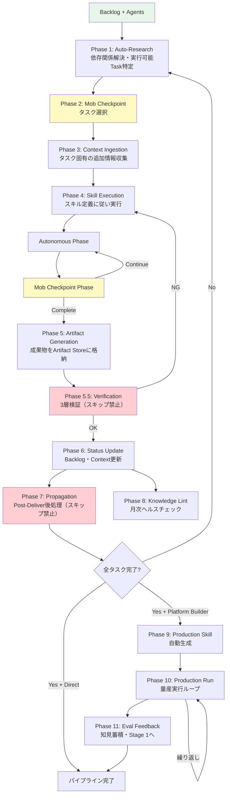

> 🏷️ **Project:** [AI-PLC Project](https://www.notion.so/268b133701be808a81bce066ce075281)
> **Type:** command
> **Context:** AI-PLC Stage 4 — Operation。Agent定義に従い各タスクを実行するステージ。Context Storeからのコンテキスト注入を伴い、成果物をArtifact Storeに格納する。実行中に発見されたコンテキストはContext Storeに追加される（Hierarchical Context Propagation）。
> 🔗 **必須コンテキスト（このスキル実行時に自動読み込み）**
> 1. [AI-PLC system](../README.md) — AI-PLCシステム全体
> 2. [RUL_plc_system](../../../rules/ai-plc-system.md) — ルートシステムルール
> 3. [RUL_plc_session](../../../rules/ai-plc-session.md) — セッション管理ルール
> 4. [RUL_plc_adaptive](../../../rules/ai-plc-adaptive.md) — Adaptive Workflow + Next Action判定
---
## 概要
> 🚀 **モダン名称:** Operation Stage
>
> **パイプライン位置:** Stage 4 of 4（最終ステージ）
>
> **Jeff Patton対応:** Deliver（本番環境への提供）
>
> **対応する旧CMD:** [CMD_aipo_04_deliver](https://www.notion.so/b30b81f5182c421bbfc49840ff436430)
>
> **AI-DLC対応:** Operation Phase（デプロイ・運用・監視）
Agent定義に従い、各タスクを**実行**するステージ。Context Storeからのコンテキスト注入を伴い、成果物をArtifact Storeに格納する。タスク実行中に発見されたコンテキスト情報はContext Storeに追加される（**Hierarchical Context Propagation**）。
> **タスクIDを指定するだけで、Agent定義に従って自動実行します**
### AI-DLC Operation対応
> ⚡ **AI-DLCのOperation Phaseに直接対応**
>
> AI-DLCではOperationフェーズでシステムのデプロイ・監視・保守をAIが担当。AI-PLCでは「タスク実行+成果物生成」としてより広く定義。
>
> - **タスク実行:** Agent定義のPhase構造に従い、Autonomous + Mob Checkpointを交互に実行
>
> - **Context更新:** 実行中に発見した情報をContext Storeに蓄積
>
> - **Production Skill自動生成:** \[Platform Builder\] 全タスク完了時に量産用スキルを自動作成
---
## 入力インターフェース
| **入力名** | **型** | **必須** | **説明** | **旧AIPO対応** |
| --- | --- | --- | --- | --- |
| Backlog | Page | ✅ | 実行対象タスクの定義 | tasks.yaml |
| Agents | Folder | ✅ | Stage 3で生成されたAgent定義群 | Commands/ |
| Context Store | Folder | ✅ | Stage 1で収集されたコンテキスト（+ 実行中の追加分） | Context/ |
| target_task | TaskID | ⭕ | 指定しない場合は実行可能タスク一覧を提示 | Task ID |
---
## 処理フロー

### Phase 1: Auto-Research（実行可能Task特定）
Backlogを読み込み、依存関係を解決し、実行可能タスク（依存解決済み・未着手）を特定。
### Phase 2: Mob Checkpoint — タスク選択
実行可能タスク一覧を提示し、人間が実行するタスクを選択。
### Phase 3: Context Ingestion（タスク実行前）
タスク実行に必要な追加情報をワークスペース/Web検索で収集 → Context Storeに追加 → Context Manifestを更新。
### Phase 4: Skill Execution
スキル定義のPhase構造に従って実行：
- **Autonomous Phase:** AIが自動で処理
- **Mob Checkpoint Phase:** 人間（またはチーム）の判断・実行を待機
- 上記を交互に繰り返し
> 🤖 **Agentとしての実行**
>
> NotionではSKL的に逐次実行される。Claude Code installでは`.claude/agents/`、Cursor installでは`.cursor/skills/ai-plc/`、Codex installでは`.agents/skills/ai-plc/`の実行面に合わせて扱う。
>
> Stage 3 Constructionで生成されたAgent定義は各環境の実行定義に相当する。
>
> 詳細: [AI-PLC README](../README.md)
### Phase 5: Artifact Generation
成果物をArtifact Store（Documents/）に格納。
### Phase 5.5: Verification（3層検証 — スキップ禁止）
> 🚨 **Adaptive Skip連動の検証ステップ。成果物生成後、Status Update前に必ず実行する。**
[RUL_plc_system](../../../rules/ai-plc-system.md) §18に基づく3層検証。workflow_depthに応じて実行レベルが変わる:
| **workflow_depth** | **実行レベル** | **検証内容** |
| --- | --- | --- |
| Simple | L1のみ | 各成果物の単体チェック（型チェック・構文・論理） |
| Standard | L1 + L2 | L1 + 全体整合性チェック（モジュール間連携・矛盾検出） |
| Complex | L1 + L2 + L3 | L1 + L2 + 受け手チェック（ユーザー視点での価値確認）+ NFR(§19) |
**出力形式（必須）:**
```javascript
🔍 Phase 5.5: Verification（[workflow_depth]）
- [x] L1: [具体的にチェックした内容と結果]
- [x] L2: [具体的にチェックした内容と結果]（Standard以上）
- [ ] L3: [チェック内容]（Complex時のみ）
```
**スキップ禁止:** L1は全タスクで必須。チェック結果を出力しない限り Phase 6 に進めない。
### Phase 5.5b: Backtrack Trigger Check（タスク単位）
> 🔄 **Phase 5.5検証の結果に基づき、パイプラインのバックトラックが必要かを自動チェックする。**
L1/L2/L3検証の結果を受けて、以下のBacktrack Trigger条件を判定:
| ID | トリガー名 | 検知条件 | 提案アクション |
| --- | --- | --- | --- |
| BT-1 | **Blocker Detection** | L1/L2でcritical NG → 後続タスクの前提が崩壊 | 「修正タスクを分解するため Re-Inception しますか？」 |
| BT-2 | **Quality Coverage Gap** | L3チェックで受け手視点の検証が不足（E2E未実施、UX未検証等） | 「検証タスクを追加するため Re-Inception しますか？」 |
| BT-5 | **External Dependency** | タスク実行中に環境変数未設定/外部サービス未準備を検知 | 「外部依存タスクをbacklogに追加しますか？」 |
| BT-6 | **Architecture Invalidation** | L2チェックで設計前提との矛盾/スケーラビリティ問題を検出 | 「設計変更をInceptionで分解しますか？」 |
**出力形式（BT該当時のみ）:**
```javascript
🔄 Phase 5.5b: Backtrack Trigger Check
- BT-X 該当: [検知理由]
- 提案: [アクション]
→ Next Action ProtocolにBacktrack選択肢を追加
```
**該当なし → Phase 6へ進行（何も出力しない）**
### Phase 6: Status Update
- Backlogのタスクステータスを更新（completed + 成果物リンク）
- Context Manifestを更新（実行中に発見した情報を追加）
- 進捗ダッシュボードを表示
- 次に実行可能なタスクを案内
### Phase 6b: Pipeline-Level Backtrack Check
> 🔄 **パイプライン全体レベルのバックトラック検知。Phase 6完了後、Phase 7の前に実行。**
| ID | トリガー名 | 検知条件 | 提案アクション |
| --- | --- | --- | --- |
| BT-3 | **Milestone Checkpoint** | root tasks or SubLayer完了率が50%または100%到達 | 「残タスクの妥当性を再評価しますか？ (Re-Inception)」 |
| BT-4 | **Goal Drift Detection** | セッション中の完了タスク数 \> 5、またはad-hocタスクが2つ以上追加されている | 「ゴールを再確認しますか？ (Re-Collection)」 |
| BT-7 | **Goal-Gap Analysis** | backlog内の全タスクがcompleted | 「ゴール達成度のGAP分析を実施しますか？ (Re-Collection)」 |
| BT-8 | **Conditional Go Gap** | Phase 5.5でConditional Go（important残あり）判定 | 「検証タスクを追加するため Re-Inception しますか？」 |
**出力形式（BT該当時のみ、Next Action Protocolに統合）:**
```javascript
🔄 **Adaptive Backtrack 検知:**
| 選択肢 | アクション | 理由 |
| D | Re-Inception | [BT-X: 検知理由] |
| E | Re-Collection | [BT-X: 検知理由] |

推奨: [A or D/E] — [推奨理由]
```
**該当なし → 通常のNext Action Protocolのみ出力（Backtrack選択肢を追加しない）**
### Phase 7: Propagation（Post-Deliver後処理 — スキップ禁止）
> 🚨 **Phase 6完了後、以下のチェックリストを全て実行するまでPhase 7は完了しない。**
>
> チェックリストを出力し、各項目の実行結果を明示すること。
>
> backlog.yaml更新（Phase 6で実施済み）以外の項目をスキップしてはならない。
[RUL_plc_system](../../../rules/ai-plc-system.md)の「Post-Deliver Propagationルール」に従い、以下を**全て実行し、結果を出力する**:
**出力形式（必須）:**
```javascript
📋 Phase 7: Propagation チェックリスト
- [x] backlog.yaml更新 — [タスクID] status → completed
- [x] context.yaml更新 — 成果物エントリ [ファイル名] を追加
- [x] memory.md — [追記した内容 or 「新規知見なし — スキップ」]
- [x] user.md — [更新内容 or 「変更なし — スキップ」]
- [x] External Sync — [sync_targets確認結果: 「未定義 → スキップ」 or 「push実行: N件」]
- [x] Wiki波及更新 — [更新内容 or 「新規性なし — スキップ」]
- [x] log.md — [エントリ追加 or 「Wiki更新なしのためスキップ」]
```
**各項目の詳細:**
1. ✅ **backlog.yaml更新** — タスクstatus → completed + Outputリンク（Phase 6で実施済み）
2. ✅ **context.yaml更新** — 成果物エントリ追加（ドキュメント名 + サマリー）
3. ✅ **[memory.md](https://www.notion.so/e96fb8b4f56146b4b5a5a946262d710d)チェック** — セッション中に学んだ知見があれば追記。なければ「新規知見なし」と明示
4. ✅ **[user.md](https://www.notion.so/ab17cd3d928c4a3696849cebcd922072)チェック** — 新しい好み・パターンがあれば更新。なければ「変更なし」と明示
5. ✅ **External Sync** — intent.yamlの`sync_targets`を**必ず読み込んで確認**。結果をログ出力:
	- sync_targets未定義 → `「sync_targets未定義 → スキップ」`と出力
	- sync_targets定義あり → 同期実行し結果を出力
6. ✅ **Wiki波及更新** — 成果物から得た知見を`.notion/wiki/`の関連トピックに追記。新規性がなければ「新規性なし」と明示
7. ✅ [**log.md**](http://log.md)**更新** — [Wiki更新があればlog.md](http://Wiki更新があればlog.md)にエントリ追加
**スキップ禁止ルール:** 各項目は「実行した結果スキップが妥当」と判断することは許容するが、「確認せずにスキップ」は禁止。必ず確認→判断→結果出力の3ステップを踏むこと。
### Phase 8: Knowledge Lint（月次ヘルスチェック）
> 🧹 **Karpathy Second BrainのLintワークフロー。**月次実行推奨。
>
> Notion環境では**カスタムエージェントの定期実行**で自動化可能。
>
> Claude Codeでは`cron` + `claude --print`、CodexではCodex appの運用方式、PalmaではWFスケジュールトリガーで実現。
>
> 詳細: [RUL_plc_system](../../../rules/ai-plc-system.md) §10
**実行フロー:**
1. [index.md](https://www.notion.so/f3e4522534ae439e8fdf798c47de0358) を読み込み、wiki配下の全トピックページを走査
2. **5項目のLintチェックリスト**を実行（[RUL_plc_system](../../../rules/ai-plc-system.md) §10参照）
3. Lintレポートを`.notion/wiki/lint-report-YYYY-MM.md`として作成
4. 🔴重要度の問題があればオーナーに通知
5. [log.md](https://www.notion.so/39918cbba9624a9c9488458786956bf0) に`lint`エントリを追加
**手動実行:**
```javascript
SKL_plc_04_operation Phase 8 Knowledge Lintを実行してください
```
---
### Phase 9: \[Platform Builder完了時\] Production Skill自動生成
全タスク完了かつmode=platform_builderの場合：
1. 実行結果から変数化ポイントを抽出
2. Parameter Storeを更新
3. Production Skill（量産用スキル定義）を自動生成
4. Phase 10（Production Run）に遷移
### Phase 10: \[Platform Builder\] Production Run（量産実行ループ）
> ⚡ **Stage 4内の量産フェーズ。**Phase 9で生成されたProduction Skillを繰り返し実行し、成果物を量産する。
**入力:**
- Production Skill（Phase 9で生成）
- Variables（Parameter Storeから取得）
- Input Data（任意：処理対象データ）
**実行フロー:**
1. **Skill読み込み** — Production Skillの実行手順を確認
2. **変数バインド** — Variablesをスキルに適用
3. **Mob Checkpoint** — 実行内容の人間確認
4. **Runtime Execution** — DB操作・AI生成・ページ作成等を実行
5. **Eval Output** — 実行結果の記録・品質評価
6. 繰り返し実行が必要な場合はステップ1に戻る
**出力:**
- Generated Artifacts（量産された成果物）
- Database Updates（ステータス・プロパティ更新）
- Eval Data（品質評価データ）
### Phase 11: Eval Feedback（知見蓄積・フィードバック）
> 🔄 **量産実績から得られた知見をContext Storeに蓄積し、Stage 1にフィードバックすることで継続改善サイクルが完成する。**
1. 実行結果の知見をContext Storeに追加
2. Context Manifestを更新
3. Wiki波及更新（有価値な知見があれば）
4. 次回改善ポイントを記録
5. **Eval Feedback Pipeline:** Stage 1: Collectionにフィードバックを戻すことで、パイプライン全体の継続改善サイクルが完成
---
## 出力インターフェース
| **出力名** | **旧AIPO名** | **説明** | **生成条件** |
| --- | --- | --- | --- |
| Artifact Store（更新） | Documents/ フォルダ | タスク成果物（ドキュメント、Database、システム等） | 常に |
| Context Store（更新） | Context/ フォルダ | タスク実行中に発見されたコンテキスト情報 | 常に |
| Context Manifest（更新） | context.yaml | 新しいContextドキュメント参照の追加 | 常に |
| Backlog（更新） | tasks.yaml | ステータス更新（completed + 成果物リンク） | 常に |
| Production Skills | Operation Commands | 量産用実行スキル | Platform Builder完了時のみ |
---
## ガードレール・ゲート
| **ゲート名** | **タイミング** | **条件** | **旧CMD対応** |
| --- | --- | --- | --- |
| **Task Selection Gate** | Phase 2 | 実行タスクの人間選択 | Step 1: Task選択 |
| **Per-Phase Guardrails** | Phase 4 | スキル定義に記載された各PhaseのMob Checkpoint | HITL Phase |
| **Artifact Validation Gate** | Phase 5 | 成果物の品質確認 | Step 5: 完了処理 |
| **Exit Gate** | Phase 6 | Backlogのステータスが更新されていること | tasks.yaml更新 |
---
## 旧CMD対応表
| **SKL_plc_04_operation** | **CMD_aipo_04_deliver** | **変更内容** |
| --- | --- | --- |
| Phase 1: Auto-Research | Step 1: AI Auto-Research | 語彙変更（Task Registry→Backlog） |
| Phase 2: Mob Checkpoint（タスク選択） | Step 2: Human Selects | HITL→Mob。チーム選択を標準オプション化 |
| Phase 3: Context Ingestion | Step 3a: Context収集 | 語彙変更のみ |
| Phase 4: Skill Execution | Step 3: AI delivers | Harness Execution→Skill Execution。構造維持 |
| Phase 5: Artifact Generation | Step 4: AI Generates | 語彙変更のみ |
| Phase 6: Status Update | Step 5: 完了処理 | Task Registry→Backlog。語彙変更 |
| Phase 7: Production Skill自動生成 | Step 6: Abstract Mode処理 | Operation Command→Production Skill。語彙変更 |
---
## → 次ステージ接続
- **通常完了時:** Backlogを更新し、次の実行可能タスクを案内（Stage 4ループ）
- **全タスク完了時（Direct Mode）:** パイプライン終了
- **全タスク完了時（Platform Builder Mode）:** Phase 9でProduction Skillを自動生成 → Phase 10で量産実行 → Phase 11でEval Feedback
---
## 💬 使用例
### 例1: 基本実行
> 💡 SKL_plc_04_operation を実行してください
>
> Layer: \[対象LayerのURL\]
### 例2: タスク指定
> 💡 SKL_plc_04_operation を実行してください
>
> Layer: \[対象LayerのURL\]
>
> Task: T001
### 例3: 完了報告
> 💡 SKL_plc_04_operation を実行してください
>
> Task: T002
>
> ステータス: 完了
>
> 成果物: 案件管理DBを作成しました
---
## ⚙️ AIへの実行指示
> 🤖 **重要: 事前参照**
>
> 実行前に必ず以下を参照：
> - [RUL_plc_system](../../../rules/ai-plc-system.md)（ルートシステムルール）
> - [RUL_plc_implementation](https://www.notion.so/eb09465cc4e54ef8b2f5c684fb8ce076)（Notion擬似プログラミングガイド）
> ---
> **AIへの指示（このスキルが@メンションされたとき）**
> ### Phase 1: Auto-Research
> 1. 対象LayerのBacklog（旧tasks.yaml）を読み込む
> 2. 実行可能なTask（依存解決済み・未着手）を特定
> 3. 一覧表示してユーザーに選択を求める
> ### Phase 2: Mob Checkpoint（タスク選択）
> 1. 実行可能タスク一覧を提示
> 2. ユーザーが選択したタスクを実行対象に設定
> ### Phase 3: Context Ingestion
> 1. タスク実行に必要な情報をワークスペース/Web検索で収集
> 2. 収集した情報をContext Storeに保存
> 3. Context Manifestを更新
> ### Phase 4: Skill Execution
> 1. タスクのスキル定義ページを読み込む
> 2. Phase構造に従って実行：
> - Autonomous Phase: AIが自動処理
> - Mob Checkpoint Phase: 人間の判断・実行を待機
> 3. 各Phaseで成果物を生成
> ### Phase 5: Artifact Generation
> 1. 成果物をArtifact Store（Documents/）に格納
> 2. 実装系タスクの場合はNotion機能で実装（DB作成、Form作成等）
> ### Phase 5.5: Verification（スキップ禁止）
> 1. intent.yamlの`workflow_depth`を確認
> 2. **L1チェック（全タスク必須）:** 各成果物の単体チェック（型チェック / 構文 / 論理 / 根拠）
> 3. **L2チェック（Standard以上）:** 全体整合性チェック（モジュール間連携 / import解決 / 矛盾検出）
> 4. **L3チェック + NFR（Complex時）:** 受け手チェック（ユーザー視点価値）+ 4NFR（パフォーマンス・セキュリティ・アクセシビリティ・再利用性）
> 5. **検証結果をチェックリスト形式で出力する（省略禁止）**
> 6. 検証で問題が見つかった場合はPhase 4に戻って修正
> ### Phase 5.5b: Backtrack Trigger Check
> 1. L1/L2/L3検証結果を受けて、BT-1/BT-2/BT-5/BT-6条件を判定（RUL_plc_adaptive §5参照）
> 2. 該当あり → Next Action ProtocolにBacktrack選択肢(D/E)を追加
> 3. 該当なし → 何も出力せずPhase 6へ進行
> ### Phase 6: Status Update
> 1. Backlogのステータスを更新（completed + 成果物リンク）
> 2. Context Manifestを更新
> 3. 進捗ダッシュボードを表示
> 4. 次に実行可能なタスクを案内
> ### Phase 6b: Pipeline-Level Backtrack Check
> 1. BT-3/BT-4/BT-7/BT-8条件を判定（RUL_plc_adaptive §5参照）
> 2. 該当あり → Next Action ProtocolにBacktrack選択肢(D/E)を統合
> 3. 該当なし → 通常のNext Action Protocolのみ
> ### Phase 8: Knowledge Lint（月次 / 手動）
> 1. `.notion/wiki/index.md`を読み込み
> 2. wiki配下の全トピックページを走査
> 3. RUL_plc_system §10のLintチェックリスト5項目を実行
> 4. `.notion/wiki/lint-report-YYYY-MM.md`にレポート出力
> 5. 🔴重要度があればオーナーに通知
> 6. `log.md`に`lint`エントリを追加
> ### Phase 9: \[Platform Builder完了時\] Production Skill自動生成
> 1. Intent（旧layer.yaml）のmodeを確認
> 2. mode=platform_builderの場合：
> - 変数抽出 → Parameter Store更新
> - Production Skill自動生成
> - Phase 10（Production Run）に遷移
> ### Phase 10: \[Platform Builder\] Production Run
> 1. Production Skill + Variablesを読み込み
> 2. 変数バインド → Mob Checkpoint → Runtime Execution → Eval Output
> 3. 繰り返し実行が必要ならステップ1に戻る
> ### Phase 11: Eval Feedback
> 1. 量産実績の知見をContext Storeに蓄積
> 2. Wiki波及更新（有価値な知見があれば）
> 3. Stage 1: Collectionにフィードバックを戻し、継続改善サイクルを完成
> ---
> **🚨 重要ルール**
> - **スキル定義の指示に忠実に従う**
> - **実装系タスクは必ずNotion機能で実装**（設計書だけで終わらない）
> - **Context収集は必須**（実行前に追加情報を収集）
> - **各Mob Checkpointでは必ず人間のアクションを待つ**
> - **成果物は具体的に記録**（「〇〇ページを作成」「ステータスを更新」等）
> ---
> **🚨 Mob Checkpoint停止強制ルール（全Phase共通）**
> - **Agent定義内のMob Checkpointでは必ず停止し、ユーザーの応答を待つ。** ユーザーの返答があるまで次のPhaseに進まない。
> - **Phase 2（タスク選択）でタスクIDが入力で指定されていても、Agent定義内のMob Checkpointは省略しない。**
> - **ショートカット禁止:** タスクID指定があっても、Phase 5.5（Verification）とPhase 7（Propagation）は省略しない。Agent定義にMob Checkpointがある場合、そこで必ず停止する。
> - 停止時は必ず🙋承認待ちブロック（具体的な応答例: OK / 修正 / 差し戻し）を出力する。
> - **「重要: 各Mob Checkpointでは必ず人間のアクションを待つ。人間の返答があるまで次のフェーズに進まない。」**
> ---
> **📝 出力フォーマット規約（必ず遵守）**
> **Phase遷移通知（セクション8）:** 各Phase完了時に📍簡易通知を必ず出力すること。Skill ExecutionのAutonomous Phaseでも「✅ Phase X 完了 → Phase X+1 に進みます」を表示し、ユーザーが途中で割り込めるタイミングを作る。
> [RUL_plc_session](../../../rules/ai-plc-session.md) セクション7-9に従い、**各Task完了時のPhase 6: Status Update** 出力には必ず以下を4パート含める：
> 1. 📍 **現在位置ヘッダー** — `📍 [Scope ID] > Stage 4: Operation > [Task ID]: [Task名] > 完了`
> 2. ✅ **完了サマリテーブル** — Scope / Task / 成果物リンク / done
> 3. 📊 **進捗ダッシュボード** — Backlog全体の進捗率（実行可能タスクに▶️を付ける）
> 4. 🔜 **Next Action Protocol** — [RUL_plc_session](../../../rules/ai-plc-session.md) セクション7.4に従い、**選択肢テーブル（A: 次Task / B: 親Layerに戻る / C: セッション終了）+ 推奨理由 + コピペ用プロンプト**の3パートを必ず出力。Stage 4 Task完了後 / 全タスク完了時のテンプレートは7.4.4参照。**ユーザーが選択肢を選んでも即実行禁止—コピペ用プロンプトを生成して返すこと。**
> Mob Checkpoint時は必ず🙋コールアウト（承認待ち/選択待ち）を末尾に配置すること。
> また、**親ScopeBacklog連動更新ルール**: SubLayer内のTaskが親ScopeBacklogのTaskに対応する場合、SubLayer Task完了時に親ScopeBacklogの該当Taskステータスも連動更新すること。
> ---
> **⚠️ AI-PLC 新命名規則（必ず遵守）**
> | 旧AIPO（❌使用禁止） | AI-PLC（✅正しい名称） |
| --- | --- |
| layer.yaml | **intent.yaml** |
| tasks.yaml | **backlog.yaml** |
| Commands/ | **Agents/** |
| 「aipo管理」 | **「AI-PLC管理」** |
> Backlog更新時のページ名は `backlog.yaml`（tasks.yamlではない）
---
## 参照元
- [T002_コマンド体系再定義書](https://www.notion.so/6c404df8242549df8199dadb2a187660) — Stage 4定義（本ページのベース）
- [T003_コア原理再定義書](https://www.notion.so/e81ef93779fd4a5c85d83a93791e3dd5) — Context Cascade / Hierarchical Context Propagation原理
- [T007_新コマンド体系アーキテクチャ設計書](https://www.notion.so/d39600b2da7142679bc22451089aeeae) — テンプレート構造・命名規則
- [CMD_aipo_04_deliver](https://www.notion.so/b30b81f5182c421bbfc49840ff436430) — 旧版コマンド（対応元）
---
**作成日:** 2026-04-07
**ステータス:** Active
**バージョン:** 1.1（Phase 5.5 Verification新設 + Phase 7 Propagation強化）
